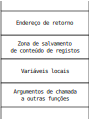

Programação em *assembly* x86-64
********************************

Suporte à linguagem C
=====================

Valores
-------
A arquitetura x86-64 realiza operações com palavras de 8, 16, 32 ou 64 *bits*.
Os registos tem nomes próprios que definem as diferentes porções. Por exemplo,
AL, AX, EAX e RAX.

Para valores operados em memória as instruções aceitam um indicador, em sufixo, que define a dimensão da palavra.

===== ============= ==========
**b** *byte*        8 *bits*
**w** *word*        16 *bits*
**l** *double word* 32 *bits*
**q** *quad word*   64 *bits*
===== ============= ==========

Existem instruções que estendem a representação
num número inferior de *bits* para um número superior de *bits*.

+-----------------------+-------------------------------+-----------------------------------------------------------------+
| movs\-\- *src*, *dst* | extensão com o *bit* de sinal | os tracinhos são substituídos pelos indicadores acima           |
+-----------------------+-------------------------------+                                                                 | 
| movz\-\- *src*, *dst* | extensão com o valor zero     | o primeiro indica a dimensão da origem e o segundo a do destino | 
+-----------------------+-------------------------------+-----------------------------------------------------------------+

Expressões
----------

Alguns exemplos de calculo de expressões numéricas.

Considerando **a** um valor expresso a 64 *bit*, previamente carregado em RAX.

+-----------------------+----------------------------+---------------------------------------+
| Deslocar p posições   |  .. code-block:: c         |  .. code-block:: asm                  |
| para a esquerda       |                            |                                       |
|                       |     a << p;                |     mov     p(%rip), %cl              |
|                       |                            |     shl     %cl, %rax                 |
+-----------------------+----------------------------+---------------------------------------+                                                    
| Afetar o bit da       | .. code-block:: c          | .. code-block:: asm                   |
| posição *p* com zero  |                            |                                       |
|                       |     a & ~(1 << p);         |     mov     p(%rip), %cl              |
|                       |                            |     mov     $1, %rdx                  |
|                       |                            |     shl     %cl, %rdx                 |
|                       |                            |     not     %rdx                      |
|                       |                            |     and     %rdx, %rax                |
+-----------------------+----------------------------+---------------------------------------+
| Afetar o bit da       |  .. code-block:: c         |  .. code-block:: asm                  |
| posição *p* com um    |                            |                                       |
|                       |     a | 1 << p;            |     mov     p(%rip), %cl              |
|                       |                            |     mov     $1, %rdx                  |
|                       |                            |     shl     %cl, %rdx                 |
|                       |                            |     or      %rdx, %rax                |
+-----------------------+----------------------------+---------------------------------------+                                                                                
| Testar o valor do     |  .. code-block:: c         |  .. code-block:: asm                  |
| bit da posição p      |                            |                                       |
|                       |     if (a & (1 << p))      |     mov     p(%rip), %cl %cl          |
|                       |                            |     mov     $1, %rdx                  |
|                       |                            |     shl     %cl, %rdx                 |
|                       |                            |     test    %rdx, %rax                |                             
|                       |                            |     jz      label                     |
+-----------------------+----------------------------+---------------------------------------+                            
| Obter o campo de      |  .. code-block:: c         |  .. code-block:: asm                  |
| n bits a começar      |                            |                                       |
| na posição p.         |     (a >> p) & ~(~0 << n); |     mov     $~0, %rdx                 |
|                       |                            |     mov     n(%rip), %cl              |
|                       |                            |     shl     %cl, %rdx                 |
|                       |                            |     not     %rdx                      |             
|                       |                            |     mov     p(%rip), %cl              |
|                       |                            |     shr     %cl, %rax                 |
|                       |                            |     and     %rdx, %rax                |
+-----------------------+----------------------------+---------------------------------------+
| Multiplicação por     |     .. code-block:: c      |  .. code-block:: asm                  |
| constante             |                            |                                       |
|                       |         a * 13;            |     # rax * 13  = (rax * 3) * 4 + rax |
|                       |                            |                                       |
|                       |                            |     lea   (%rax, %rax, 2), %rdx       |
|                       |                            |     lea   (%rax, %rdx, 4), %eax       |
+-----------------------+----------------------------+---------------------------------------+

 
Considerando **a** um valor expresso a 128 bit previamente carregado em RDX:RAX.
                  
+-----------------------+----------------------------+---------------------------------------+
| Deslocar 1 posição    |      .. code-block:: c     |  .. code-block:: asm                  |
| para a esquerda       |                            |                                       |
|                       |         a <<= 1;           |     shl    $1, %rax                   |
|                       |                            |     rcl    $1, %rdx                   |
+-----------------------+----------------------------+---------------------------------------+                             
| Deslocar 1 posição    |      .. code-block:: c     |  .. code-block:: asm                  |
| para a direita        |                            |                                       |
|                       |         a >>= 1;           |     shr    $1, %rdx                   |
|                       |                            |     rcr    $1, %rax                   |
+-----------------------+----------------------------+---------------------------------------+
| Deslocar **p**        |     .. code-block:: c      |  .. code-block:: asm                  | 
| posições              |                            |                                       |
| para a esquerda       |        a <<= p;            |     mov     p(%rip), %cl              |
|                       |                            |     shld    %cl, %rax, %rdx           |
|                       |                            |     shl     $cl, %rax                 |
+-----------------------+----------------------------+---------------------------------------+
| Deslocar **N**        |     .. code-block:: c      |  .. code-block:: asm                  | 
| posições              |                            |                                       |
| para a direita        |        a >>= N;            |     shrd    $N, %rdx, %rax            |
|                       |                            |     shr     $N, %rdx                  |
+-----------------------+----------------------------+---------------------------------------+
                                                          
                                                                                
Controlo da execução
--------------------

*if*
....

*if* sem *else*

+----------------------------------------------------------------+----------------------------------------------------------------+
| .. literalinclude:: ../../../code/assembly_x86_64/control/if.c | .. literalinclude:: ../../../code/assembly_x86_64/control/if.s |
|   :language: c                                                 |    :language: asm                                              |
|                                                                |                                                                |
| \(a\)                                                          | \(b\)                                                          |
+----------------------------------------------------------------+----------------------------------------------------------------+

*if* com *else*

+---------------------------------------------------------------------+---------------------------------------------------------------------+
| .. literalinclude:: ../../../code/assembly_x86_64/control/if_else.c | .. literalinclude:: ../../../code/assembly_x86_64/control/if_else.s |
|   :language: c                                                      |    :language: asm                                                   |
|                                                                     |                                                                     |
| \(a\)                                                               | \(b\)                                                               |
+---------------------------------------------------------------------+---------------------------------------------------------------------+

switch
......

+---------------------------------------------------------------------+---------------------------------------------------------------------+
| .. literalinclude:: ../../../code/assembly_x86_64/control/switch.c  | .. literalinclude:: ../../../code/assembly_x86_64/control/switch.s  |
|   :language: c                                                      |    :language: asm                                                   |
|                                                                     |                                                                     |
| \(a\)                                                               | \(b\)                                                               |
+---------------------------------------------------------------------+---------------------------------------------------------------------+

do while
........

+----------------------------------------------------------------------+----------------------------------------------------------------------+
| .. literalinclude:: ../../../code/assembly_x86_64/control/do_while.c | .. literalinclude:: ../../../code/assembly_x86_64/control/do_while.s |
|    :language: c                                                      |    :language: asm                                                    |
|                                                                      |                                                                      |
| \(a\)                                                                | \(b\)                                                                |
+----------------------------------------------------------------------+----------------------------------------------------------------------+

while
.....

+----------------------------------------------------------------------+----------------------------------------------------------------------+----------------------------------------------------------------------+
| .. literalinclude:: ../../../code/assembly_x86_64/control/while.c    | .. literalinclude:: ../../../code/assembly_x86_64/control/while1.s   | .. literalinclude:: ../../../code/assembly_x86_64/control/while2.s   |
|    :language: c                                                      |    :language: asm                                                    |    :language: asm                                                    |
|                                                                      |                                                                      |                                                                      |
| \(a\)                                                                | \(b\)                                                                | \(c\)                                                                |
+----------------------------------------------------------------------+----------------------------------------------------------------------+----------------------------------------------------------------------+

for
...

+----------------------------------------------------------------------+----------------------------------------------------------------------+
| .. literalinclude:: ../../../code/assembly_x86_64/control/for.c      | .. literalinclude:: ../../../code/assembly_x86_64/control/for.s      |
|    :language: c                                                      |    :language: asm                                                    |
|                                                                      |                                                                      |
| \(a\)                                                                | \(b\)                                                                |
+----------------------------------------------------------------------+----------------------------------------------------------------------+

Funções
-------

A chamada a função é realizada com a instrução **call**
e o retorno é realizado com a instrução **ret**.

A instrução **call** empilha o endereço da próxima instrução no topo do *stack*.
Nessa altura RIP já contém o endereço da instrução seguinte, designado por endereço de retorno.
Depois executa um salto para o endereço de início da função chamada (*callee*).

A instrução **call <endereço>** é equivalente à sequência **push rip; jmp <endereço**.

**Exemplos**:

   * ``call label``	salto relativo; a distância até à *label* é embutida no código da instrução.
   * ``call *%rax``	salto absoluto; o registo RAX contém o endereço da função
   * ``call *(%rax)``	salto absoluto; o registo RAX contém o endereço da posição de memória ende se encontra o endereço da função
   
   
Para retornar à função chamadora (*caller*), a função chamada executa,
em último lugar, a instrução **ret**.
Esta instrução desempilha para o registo RIP, o endereço empilhado pela última instrução **call**,
provocando o regresso à função chamadora.

A instrução **ret** é equivalente a **pop rip**

Função sem parâmetros
.....................

+----------------------------------------------------------------------+--------------------------------------------------------------------------+
| .. literalinclude:: ../../../code/assembly_x86_64/function/delay.c   | .. literalinclude:: ../../../code/assembly_x86_64/function/delay_asm.s   |
|    :language: c                                                      |    :language: asm                                                        |
|    :caption: delay.c                                                 |    :caption: delay_asm.s                                                 |
+----------------------------------------------------------------------+--------------------------------------------------------------------------+

+--------------------------------------------------------------------------+------------------------------------------------------------------------------+
| .. literalinclude:: ../../../code/assembly_x86_64/function/use_delay.c   | .. literalinclude:: ../../../code/assembly_x86_64/function/use_delay_asm.s   |
|    :language: c                                                          |    :language: asm                                                            |
|    :caption: use_delay.c                                                 |    :caption: use_delay_asm.s                                                 |
+--------------------------------------------------------------------------+------------------------------------------------------------------------------+

Geração do executável: ::

   $ gcc -Og -g use_delay.c delay_asm.s -o use_delay

Teste com *debugger*: ::

   $ insight use_delay

Função com parâmetros
.....................

Os argumentos de uma função são passados nos registos RDI, RSI, RDX, RCX, R8 e R9,
por esta ordem, até se esgotarem estes registos.
Caso seja necessário, os restantes argumentos, são passados em *stack*.
O retorno é feito em AL, AX, EAX, RAX ou em RDX:RAX, conforme o tipo.

No caso de retorno de uma struct com dimensão superior a 128 bits,
o chamador passa um argumento extra, que é o endereço de uma zona de memória,
reservada pelo chamador, onde a função deposita o resultado.

+------------------------------------------------------------------------+----------------------------------------------------------------------------+
| .. literalinclude:: ../../../code/assembly_x86_64/function/packdate.c  | .. literalinclude:: ../../../code/assembly_x86_64/function/packdate_asm.s  |
|    :language: c                                                        |    :language: asm                                                          |
|    :caption: packdate.c                                                |    :caption: getbits_asm.s                                                 |
+------------------------------------------------------------------------+----------------------------------------------------------------------------+

+----------------------------------------------------------------------------+--------------------------------------------------------------------------------+
| .. literalinclude:: ../../../code/assembly_x86_64/function/use_packdate.c  | .. literalinclude:: ../../../code/assembly_x86_64/function/use_packdate_asm.s  |
|    :language: c                                                            |    :language: asm                                                              |
|    :caption: use_packdate.c                                                |    :caption: use_packdate_asm.s                                                |
+----------------------------------------------------------------------------+--------------------------------------------------------------------------------+

+------------------------------------------------------------------------+----------------------------------------------------------------------------+
| .. literalinclude:: ../../../code/assembly_x86_64/function/getbits.c   | .. literalinclude:: ../../../code/assembly_x86_64/function/getbits_asm.s   |
|    :language: c                                                        |    :language: asm                                                          |
|    :caption: getbits.c                                                 |    :caption: getbits_asm.s                                                 |
+------------------------------------------------------------------------+----------------------------------------------------------------------------+

+----------------------------------------------------------------------------+--------------------------------------------------------------------------------+
| .. literalinclude:: ../../../code/assembly_x86_64/function/use_getbits.c   | .. literalinclude:: ../../../code/assembly_x86_64/function/use_getbits_asm.s   |
|    :language: c                                                            |    :language: asm                                                              |
|    :caption: use_getbits.c                                                 |    :caption: use_getbits_asm.s                                                 |
+----------------------------------------------------------------------------+--------------------------------------------------------------------------------+

Geração do executável: ::

   $ gcc -Og -g use_getbits.c getbits_asm.s -o use_getbits

Teste com *debugger*: ::

   $ insight use_getbits

Acesso a dados
--------------

Designam-se por variáveis estáticas, as variáveis alocadas em memória na altura da compilação.
São as variáveis globais e as variáveis locais com atributo **static**.

Em linguagem C quando se define uma variável estática
estabelece-se um símbolo (no exemplo **a**, **i** ou **cp**) que representa o conteúdo dessa variável.
Por exemplo: ::

    char a;
    int i;
    char *cp;

Em linguagem *assembly* esse símbolo corresponde a uma *label* que define o endereço dessa variável em memória. ::

   	.bss
   a:	.byte	0
   	.align	4
   i:	.long	0
   	.align	8
   cp:	.quad	0

O compilador **gcc** na arquitetura **x86-64**,
realiza o acesso ao conteúdo dessas variáveis com endereçamento relativo ao RIP. ::

   mov    a(%rip), %al

Em linguagem C quando se define um *array* estabelece-se um símbolo (no exemplo, **ca** e **ia**)
que representa o ponteiro para o primeiro elemento do *array*. ::

   char ca[10]; 
   int ia[10];

Em *assembly* este símbolo corresponde a uma *label* que define
o endereço inicial da zona de memória onde o *array* é alojado. ::

   ca:	.space	10, 0
   ia:	.space	10 * 4, 0

Para aceder aos elementos do *array* começa-se por carregar num registo o endereço atual dessa *label* ::

   lea    ai(%rip), %rax

em seguida utiliza-se esse registo -- neste exemplo RAX --
como a base de formação do endereço do elemento a aceder.
O registo RCX é usado como índice do *array* e o valor 4 atua como fator de escala
por se tratar de um *array* de inteiros. ::

   mov    (%rax, %rcx, 4), %edx

.. table:: Exemplos de operações com ponteiros
   :widths: auto
   :align: center
   
   +------------------------------------+------------------------------------------+
   |   .. code-block:: c                |   .. code-block:: asm                    |
   |                                    |                                          |
   |      &cp = *a                      |      lea    a(%rip), %rax                |
   |                                    |      mov    %rax, cp(%rip)               |             
   +------------------------------------+------------------------------------------+
   |   .. code-block:: c                |   .. code-block:: asm                    |
   |                                    |                                          |
   |      cp++                          |      incq   cp(%rip)                     |
   +------------------------------------+------------------------------------------+
   |   .. code-block:: c                |   .. code-block:: asm                    |
   |                                    |                                          |
   |      ip++                          |      addq   $4, ip(%rip)                 |
   +------------------------------------+------------------------------------------+
   |   .. code-block:: c                |   .. code-block:: asm                    |
   |                                    |                                          |
   |      ip = ip + i                   |      mov    i(%rip), %eax                |
   |                                    |      shl    $2, %rax                     |
   |                                    |      add    %rax, ip(%rip)               |
   +------------------------------------+------------------------------------------+
   |   .. code-block:: c                |   .. code-block:: asm                    |
   |                                    |                                          |
   |      ip = ip - iq                  |      mov    iq(%rip), %rax               |
   |                                    |      sub    ip(%rip), %rax               |
   |                                    |      shr    $2, %rax                     |
   |                                    |      mov    %eax, j(%rip)                |
   +------------------------------------+------------------------------------------+
   |   .. code-block:: c                |   .. code-block:: asm                    |
   |                                    |                                          |
   |      b = *cp                       |      mov    cp(%rip), %rax               |
   |                                    |      mov    (%rax), %al                  |
   |                                    |      mov    %al, b(%rip)                 |
   +------------------------------------+------------------------------------------+
   |   .. code-block:: c                |   .. code-block:: asm                    |
   |                                    |                                          |
   |      j = *ip                       |      mov    ip(%rip), %rax               |
   |                                    |      mov    (%rax), %eax                 |
   |                                    |      mov    %eax, j(%rip)                |
   +------------------------------------+------------------------------------------+
   |   .. code-block:: c                |   .. code-block:: asm                    |
   |                                    |                                          |
   |      j = *(ip + i);                |      mov    ip(%rip), %rax               |
   |                                    |      mov    i(%rip), %esi                |
   |   .. code-block:: c                |      mov    (%rax, %rsi, 4), %eax        |
   |                                    |      mov    %eax, j(%rip)                |
   |      j = ip[i];                    |                                          |
   +------------------------------------+------------------------------------------+

Variáveis simples
.................

+-------------------------------------------------------------------------------+-----------------------------------------------------------------------------------+
| .. literalinclude:: ../../../code/assembly_x86_64/data_access/use_packdate.c  | .. literalinclude:: ../../../code/assembly_x86_64/data_access/use_packdate_asm.s  |
|    :language: c                                                               |    :language: asm                                                                 |
|    :caption: use_packdate.c                                                   |    :caption: use_packdate_asm.s                                                   |
+-------------------------------------------------------------------------------+-----------------------------------------------------------------------------------+

+-------------------------------------------------------------------------------+-----------------------------------------------------------------------------------+
| .. literalinclude:: ../../../code/assembly_x86_64/data_access/use_getbits.c   | .. literalinclude:: ../../../code/assembly_x86_64/data_access/use_getbits_asm.s   |
|    :language: c                                                               |    :language: asm                                                                 |
|    :caption: use_getbits.c                                                    |    :caption: use_getbits_asm.s                                                    |
+-------------------------------------------------------------------------------+-----------------------------------------------------------------------------------+

+-------------------------------------------------------------------------------+-----------------------------------------------------------------------------------+
| .. literalinclude:: ../../../code/assembly_x86_64/data_access/unpackdate.c    | .. literalinclude:: ../../../code/assembly_x86_64/data_access/unpackdate_asm.s    |
|    :language: c                                                               |    :language: asm                                                                 |
|    :caption: unpackdate.c                                                     |    :caption: unpackdate_asm.s                                                     |
+-------------------------------------------------------------------------------+-----------------------------------------------------------------------------------+

+---------------------------------------------------------------------------------+-------------------------------------------------------------------------------------+
| .. literalinclude:: ../../../code/assembly_x86_64/data_access/use_unpackdate.c  | .. literalinclude:: ../../../code/assembly_x86_64/data_access/use_unpackdate_asm.s  |
|    :language: c                                                                 |    :language: asm                                                                   |
|    :caption: use_unpackdate.c                                                   |    :caption: use_unpackdate_asm.s                                                   |
+---------------------------------------------------------------------------------+-------------------------------------------------------------------------------------+

*Array* de caracteres -- *strings*
..................................

+------------------------------------------------------------------------+----------------------------------------------------------------------------+
| .. literalinclude:: ../../../code/assembly_x86_64/function/strlen.c    | .. literalinclude:: ../../../code/assembly_x86_64/function/strlen_asm.s    |
|    :language: c                                                        |    :language: asm                                                          |
|    :caption: strlen.c                                                  |    :caption: strlen_asm.s                                                  |
+------------------------------------------------------------------------+----------------------------------------------------------------------------+

+----------------------------------------------------------------------------+--------- ----------------------------------------------------------------------+
| .. literalinclude:: ../../../code/assembly_x86_64/function/use_strlen.c    | .. literalinclude:: ../../../code/assembly_x86_64/function/use_strlen_asm.s    |
|    :language: c                                                            |    :language: asm                                                              |
|    :caption: use_strlen.c                                                  |    :caption: use_strlen_asm.s                                                  |
+----------------------------------------------------------------------------+--------------------------------------------------------------------------------+

Geração do executável: ::

   $ gcc -Og -g use_strlen.c strlen_asm.s -o use_strlen

Teste com *debugger*: ::

   $ insight use_strlen

+----------------------------------------------------------------------------+--------------------------------------------------------------------------------+
| .. literalinclude:: ../../../code/assembly_x86_64/function/use_strlen2.c   | .. literalinclude:: ../../../code/assembly_x86_64/function/use_strlen2_asm.s   |
|    :language: c                                                            |    :language: asm                                                              |
|    :caption: use_strlen2.c                                                 |    :caption: use_strlen2_asm.s                                                 |
+----------------------------------------------------------------------------+--------------------------------------------------------------------------------+

*Array* de inteiros
...................

+-------------------------------------------------------------------------------+-----------------------------------------------------------------------------------+
| .. literalinclude:: ../../../code/assembly_x86_64/data_access/findbigger.c    | .. literalinclude:: ../../../code/assembly_x86_64/data_access/findbigger_asm.s    |
|    :language: c                                                               |    :language: asm                                                                 |
|    :caption: findbigger.c                                                     |    :caption: findbigger_asm.s                                                     |
+-------------------------------------------------------------------------------+-----------------------------------------------------------------------------------+

+---------------------------------------------------------------------------------+-------------------------------------------------------------------------------------+
| .. literalinclude:: ../../../code/assembly_x86_64/data_access/use_findbigger.c  | .. literalinclude:: ../../../code/assembly_x86_64/data_access/use_findbigger_asm.s  |
|    :language: c                                                                 |    :language: asm                                                                   |
|    :caption: use_findbigger.c                                                   |    :caption: use_findbigger_asm.s                                                   |
+---------------------------------------------------------------------------------+-------------------------------------------------------------------------------------+

*Array* de *struct*
...................

+-------------------------------------------------------------------------------+-----------------------------------------------------------------------------------+
| .. literalinclude:: ../../../code/assembly_x86_64/data_access/getlighter.c    | .. literalinclude:: ../../../code/assembly_x86_64/data_access/getlighter_asm.s    |
|    :language: c                                                               |    :language: asm                                                                 |
|    :caption: getlighter.c                                                     |    :caption: getlighter_asm.s                                                     |
+-------------------------------------------------------------------------------+-----------------------------------------------------------------------------------+

+---------------------------------------------------------------------------------+-------------------------------------------------------------------------------------+
| .. literalinclude:: ../../../code/assembly_x86_64/data_access/use_getlighter.c  | .. literalinclude:: ../../../code/assembly_x86_64/data_access/use_getlighter_asm.s  |
|    :language: c                                                                 |    :language: asm                                                                   |
|    :caption: use_getlighter.c                                                   |    :caption: use_getlighter_asm.s                                                   |
+---------------------------------------------------------------------------------+-------------------------------------------------------------------------------------+

Convenções de utilização de registos
------------------------------------

Os registos RAX, RCX, RDX, RSI, RDI, R8, R9, R10 e R11 podem ser modificados pela função chamada,
os registos RBX, RBP, R12, R13, R14 e R15, se forem utilizados, devem ser preservados.

   
A cadeia de chamadas a funções num programa pode ser visualizada como uma árvore
em que a função **main** se situa na posição da raiz. 
As funções que são chamadas e que também chamam outras funções,
situam-se nas posições dos ramos e são designadas por \"funções ramo\";
as funções que apenas são chamadas situam-se nas posições das folhas
e são designadas por \"funções folha\".

Para efeitos de escolha dos registos a utilizar,
interessa classificar as funções como \"funções folha\" ou como \"funções ramo\".

Função folha
..............
   
   * Deve-se operar os argumentos diretamente no registos que os transportam.
   * Deve-se preferir utilizar os registos *caller saved*.
   * Se tiver que se utilizar os registos *callee saved* deve-se assegurar à saída da função o mesmo conteúdo que tinham à entrada.
    

Função ramo
...........

   * Reutiliza os registos de parâmetros na chamada a outras funções.
   * Deve-se salvar os argumentos recebidos em registos *callee saved* ou em *stack*.
   * Deve-se alojar variáveis locais em registos *callee saved* ou em *stack*.
   * Se se optar por utilizar registos *caller saved* ou manter os argumentos recebidos no registos originais
     deve-se salvar esses registos antes de proceder à chamada de outra função.

**Exemplo**

+----------------------------------------------------------------------------+--------------------------------------------------------------------------------+
| .. literalinclude:: ../../../code/assembly_x86_64/function/sort.c          | .. literalinclude:: ../../../code/assembly_x86_64/function/sort_asm.s          |
|    :language: c                                                            |    :language: asm                                                              |
|    :caption: sort.c                                                        |    :caption: sort_asm.s                                                        |
+----------------------------------------------------------------------------+--------------------------------------------------------------------------------+

Organização da *stack frame*
----------------------------
Na *stack frame* alojam-se os conteúdos dos registos a preservar,
as variáveis locais e argumentos de chamada a outras funções.

Variáveis locais em *stack*
---------------------------

As variáveis locais são alojadas em *stack* se:
 
   * a sua quantidade excede o número de registos disponíveis;
   * a sua dimensão não permite o alojamento em registo -- é o caso dos *arrays*;
   * é necessário aceder a essas variáveis através de ponteiros.

+---------------------------------------------------------------------------------+-------------------------------------------------------------------------------------+
| .. literalinclude:: ../../../code/assembly_x86_64/stack_frame/use_unpackdate.c  | .. literalinclude:: ../../../code/assembly_x86_64/stack_frame/use_unpackdate_asm.s  |
|    :language: c                                                                 |    :language: asm                                                                   |
|    :caption: use_unpackdate.c                                                   |    :caption: use_unpackdate_asm.s                                                   |
|                                                                                 |    :linenos:                                                                        |
+---------------------------------------------------------------------------------+-------------------------------------------------------------------------------------+

   
À entrada da função o registo RSP apresenta o endereço de memória ``0x7fffffffdd58``.
A instrução ``sub $24, %rsp`` ao subtrair 24 a RSP,
reserva espaço para alojar as variáveis ``year``, ``month`` e ``day``.
Para alojar três variáveis do tipo int são necessários 12 *bytes*.
Como RSP deve estar alinhado num endereço múltiplo de 16 na chamada a uma função,
são subtraídas 24 posições de memória.
As posições de memória entre ``0x7fffffffdd40`` e ``0x7fffffffdd43`` e entre ``0x7fffffffdd50`` e ``0x7fffffffdd57`` não são utilizadas.
Nas linhas 5, 6 e 7 são preparados os argumentos para a chamada à função ``unpack_date``, que são os ponteiros para as variáveis ``year``, ``month`` e ``day``.
A instrução ``add $24, %rsp`` reposiciona RSP no endereço inicial.

*Array* de dimensão variável
............................

Alojamento de *array* local de dimensão variável em *stack*. (Sem proteção de *stack clash*.)

Consideremos a função ``get_year`` que extrai a componente ano, na forma de inteiro,
de uma data representada numa *string* com o formato "2020-9-3".

+---------------------------------------------------------------------------+------------------------------------------------------------------------------+
| .. literalinclude:: ../../../code/assembly_x86_64/stack_frame/getyear.c   | .. literalinclude:: ../../../code/assembly_x86_64/stack_frame/getyear_asm.s  |
|    :language: c                                                           |    :language: asm                                                            |
|    :caption: getyear.c                                                    |    :caption: getyear_asm.s                                                   |
|                                                                           |    :linenos:                                                                 |
+---------------------------------------------------------------------------+------------------------------------------------------------------------------+

A reserva de espaço para o *array* local ``buffer`` é realizada nas linhas 14, 15 e 16.
A dimensão necessária é estabelecida na linha 13 -- valor retornado por ``strlen`` mais um.

Na linha 14 e 15 essa dimensão em EAX é arredondada por excesso para um valor múltiplo de 16. 
((EAX + 15)  / 16)  * 16 ( o sinal / representa divisão inteira).

Na linha 16 esse valor é subtraído a RSP consumando a reserva de espaço de memória para o array local buffer.
No final da função, RSP é restabelecido com o valor de RBP -- linha 26. Sendo uma solução simples para de reajuste do RSP e libertação do espaço de memória reservado.
Nas circunstâncias em que o espaço de memória a reservar em stack é variável, o gcc por omissão gera código de mitigação do efeito stack clash. O código apresentado acima foi gerado pelo gcc sob o efeito da opção -fno-stack-clash-protection.

Passagem de argumentos em *stack*
---------------------------------

Na invocação de funções com mais de seis parâmetros,
os argumentos para além do sexto são passados em *stack*.
Estes argumentos são empilhados no *stack* pela ordem inversa da lista de parâmetros da função.
O argumento correspondente ao último parâmetro é o primeiro a ser empilhado
e consequentemente ocupará o endereço mais alto.
O argumento do parâmetro mais à esquerda é o que fica no topo do *stack*.

+---------------------------------------------------------------------------------+-------------------------------------------------------------------------------------+
| .. literalinclude:: ../../../code/assembly_x86_64/stack_frame/use_func8args.c   | .. literalinclude:: ../../../code/assembly_x86_64/stack_frame/use_func8args_asm.s   |
|    :language: c                                                                 |    :language: asm                                                                   |
|    :caption: use_func8args.c                                                    |    :caption: use_func8args_asm.s                                                    |
|                                                                                 |    :linenos:                                                                        |
+---------------------------------------------------------------------------------+                                                                                     |
| .. figure:: stack1.svg                                                          |                                                                                     |
|    :align: center                                                               |                                                                                     |
|    :scale: 100%                                                                 |                                                                                     |
|                                                                                 |                                                                                     |
+---------------------------------------------------------------------------------+-------------------------------------------------------------------------------------+

Na linha 6 empilha-se o oitavo argumento -- o ponteiro para ``x4``.
Na linha 8 empilha-se o sétimo argumento -- o valor de ``x4``.
Note-se que apesar de ser do tipo ``char`` a passagem é feita numa palavra de 64 *bits*.
Entre as linhas 9 e 14 procede-se à passagem em registo dos restantes seis argumentos.

A convenção de chamada a funções define que na altura da execução da instrução ``call``
o registo RSP deve estar alinhado num endereço múltiplo de 16.
Como consequência, à entrada de uma função, o RSP está sempre desalinhado de endereço múltiplo de 16. 
Assim, a função atual pode basear-se neste pressuposto para efeito de alinhamento do RSP ao realizar outras chamadas.
A instrução ``sub  $8, %rsp`` na linha 4 serve para cumprir esta convenção.
Até à instrução ``call`` na linha 15, o RSP vai ser decrementado de 24 ficando alinhado num endereço múltiplo de 16.

+---------------------------------------------------------------------------------+-------------------------------------------------------------------------------------+
| .. literalinclude:: ../../../code/assembly_x86_64/stack_frame/func8args.c       | .. literalinclude:: ../../../code/assembly_x86_64/stack_frame/func8args_asm.s       |
|    :language: c                                                                 |    :language: asm                                                                   |
|    :caption: func8args.c                                                        |    :caption: func8args_asm.s                                                        |
|                                                                                 |    :linenos:                                                                        |
+---------------------------------------------------------------------------------+                                                                                     |
| .. figure:: stack2.svg                                                          |                                                                                     |
|    :align: center                                                               |                                                                                     |
|    :scale: 100%                                                                 |                                                                                     |
|                                                                                 |                                                                                     |
+---------------------------------------------------------------------------------+-------------------------------------------------------------------------------------+

No início da execução de uma função o endereço de retorno apresenta-se no topo do *stack*,
depois dos argumentos da função.
O acesso aos argumentos é realizado com base em RSP.
O acesso a ``a4p`` é realizado na linha 4.
``16(%rsp)`` equivale ao endereço ``0x7fffffffdd60`` que é o local do *stack* onde ser encontra o argumento ``&x4``.

O acesso a ``a4`` é realizado na linha 8. ``8(%rsp)`` equivale ao endereço ``0x7fffffffdd58``
que é o local do *stack* onde se encontra o argumento ``x4``.

**Exemplo 14**

Neste exemplo vai ser mostrada uma utilização do *stack* mais abrangente.
Além de utilizado na passagem de argumentos vai também ser utilizado para alojamento de variáveis locais.
O exemplo é semelhante ao anterior com a diferença das variáveis ``x1``, ``x2``, ``x3`` e ``x4``
serem locais à função ``use_func8args``.

.. literalinclude:: ../../../code/assembly_x86_64/stack_frame/use2_func8args.c
   :language: c
   :caption: use2_func8args.c
   :linenos:

+------------------------------------------------------------------------------------+-------------------------------+
| .. literalinclude:: ../../../code/assembly_x86_64/stack_frame/use2_func8args_asm.s | .. figure:: stack5.svg        |
|    :language: asm                                                                  |    :align: center             |
|    :caption: use2_func8args_asm.s                                                  |    :scale: 100%               |
|    :linenos:                                                                       |                               |
+------------------------------------------------------------------------------------+-------------------------------+

O bloco de código inicial linhas 4 a 6 designa-se por preâmbulo da função.
No preâmbulo, linhas 4 e 5, o registo RBP é preparado para acesso aos valores em stack
-- argumentos e variáveis locais.
Na linha 6 a adição de 16 a RSP reserva espaço de memória em *stack* para as variáveis locais.

O registo RSP sofre um decremento de 40 unidades até à instrução ``call`` o que garante o alinhamento a múltiplo de 16.

O registo RBP indica sempre a mesma posição do *stack*
-- a seguir ao endereço de retorno, onde é salvo o conteúdo de RBP da função chamadora
-- e  mantém-se fixo durante a execução da função.

Para aceder aos parâmetros são usados deslocamentos positivos em relação a RBP:
``8(%rbp)`` corresponde ao primeiro argumento em *stack*,
``16(%rbp)`` corresponde ao segundo argumento e assim sucessivamente.

Para aceder às variáveis locais são usados deslocamentos negativos em relação a RBP:
``-8(%rbp)`` corresponde à primeira variável local -- ``x1``,
``-12(%rbp)`` corresponde à segunda variável local -- ``x2``,
``-14(%rbp)`` corresponde à terceira variável local -- ``x3`` e
``-15(%rbp)`` corresponde à quarta variável local -- ``x4``.

Ao retornar da função é necessário repor RSP exatamente no estado inicial
-- libertar o espaço usado para passagem de argumentos,
libertar o espaço reservado para variáveis locais
e repor em RBP o conteúdo original.

O código responsável por esta operação designa-se por epílogo
e neste caso é formado pelas instruções das linhas 31 e 32.
A instrução ``mov    %rsp, %rbp`` ao reposicionar RSP na posição de RBP,
liberta simultaneamente o espaço ocupado em *stack* quer no alojamento de variáveis locais,
quer na passagem de argumentos.

*Buffer overflow*
-----------------

A situação conhecida como *buffer overflow* caracteriza-se pelo acesso a posições de memória
além dos limites das variáveis.
O caso mais conhecido passa-se com a função **gets**. ::

   char* gets( char *str );

A função **gets** lê caracteres do *standard input*
e escreve-os no *array* passado em parâmetro
até ler uma marca de fim de linha -- **\\n**.
Se o *array* apontado por ``str`` tiver uma dimensão inferior ao número de caracteres lidos,
a função **gets** escreve-os para além do limite do *array*,
corrompendo informação armazenada na vizinhança.

A função **gets** foi retirada da biblioteca normalizada da linguagem C
pelo potencial de falha que permite introduzir num programa.

No exemplo, se o número de caracteres lido for superior a 7, irá ocorrer falha.
Quais as consequências dessa falha?

+------------------------------------------------------------------------------+---------------------------------------------------------------------------------+
| .. literalinclude:: ../../../code/assembly_x86_64/buffer_overflow/secret.c   | .. literalinclude:: ../../../code/assembly_x86_64/buffer_overflow/secret_asm.s  |
|    :language: c                                                              |    :language: asm                                                               |
|    :caption: secret.c                                                        |    :caption: secret_asm.s                                                       |
|                                                                              |    :linenos:                                                                    |
+------------------------------------------------------------------------------+---------------------------------------------------------------------------------+

Geração do executável: ::

   $ gcc secret.c -fno-stack-protector -o secret

**Exercícios**

   1. Fazer com que a sequência de caracteres introduzida provoque a execução de print_secret(1).

   2. Fazer com que a sequência de caracteres introduzida provoque a execução de print_secret(2).

*Stack protector*
-----------------

O **gcc** dispõe de um meio, não eficaz, de deteção da ocorrência de *buffer overflow*.
À entrada na função é posicionada uma marcação no limite da *stack frame*;
à saída da função verifica-se se a marcação foi corrompida.
Esta marcação é designada por \"canário\".

Esta funcionalidade é ativada/desativada através das opções seguintes.
Por omissão, é ativada. ::

   -fstack-protector
   -fno-stack-protector

+---------------------------------------------------------------------------------------+------------------------------------------------------------------------------------------+
| .. literalinclude:: ../../../code/assembly_x86_64/buffer_overflow/stack_protector.c   | .. literalinclude:: ../../../code/assembly_x86_64/buffer_overflow/stack_protector_asm.s  |
|    :language: c                                                                       |    :language: asm                                                                        |
|    :caption: stack_protector.c                                                        |    :caption: stack_protector_asm.s                                                       |
|                                                                                       |    :linenos:                                                                             |
+---------------------------------------------------------------------------------------+------------------------------------------------------------------------------------------+

*Stack clash*
-------------

O *stack clash* acontece quando a dimensão de uma variável local depende de um parâmetro (a dimensão é variável).
As variáveis locais são alojadas no *stack* por deslocação do *stack pointer*.
Se esta deslocação ultrapassar certos limites pode colidir com outras zonas de memória.

O *gcc* dispõe de uma opção de compilação para ativar/desativar
a geração de código de mitigação de *stack clash*. ::

   -fstack-clash-protection
   -fno-stack-clash-protection

Referências
===========

   * Calling conventions for different C++ compilers and operating systems, https://www.agner.org/optimize/calling_conventions.pdf

   * System V Application Binary Interface -- AMD64 Architecture Processor Supplement, https://wiki.osdev.org/System_V_ABI#x86-64

   * Application Binary Interface for the Arm® Architecture -- The Base Standard https://developer.arm.com/documentation/ihi0036/d/?lang=en#the-generic-c-abi

   * Compiler Explorer, https://gcc.godbolt.org/

   * Using AS, https://sourceware.org/binutils/docs-2.25/as/index.html

   * Intel® 64 and IA-32 Architectures Software Developer Manuals, http://www.intel.com/content/www/us/en/processors/architectures-software-developer-manuals.html

