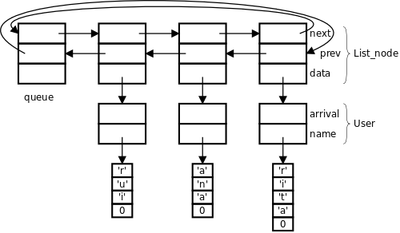
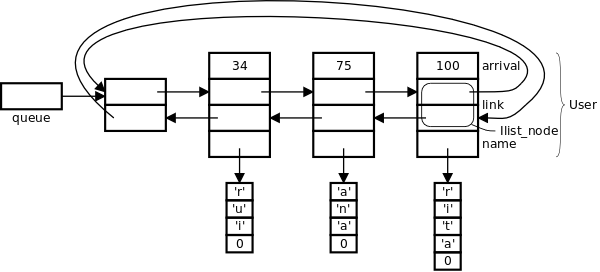

.. _data_structures_double_link_list:

Lista ligada
============

São realizadas várias versões do programa para exemplificar a utilização
de diversos tipos de lista e técnicas de programação em linguagem C.
Designadamente:

   * lista simplesmente ligada;
   * lista duplamente ligada;
   * lista não intrusiva;
   * lista genérica não intrusiva;
   * lista genérica intrusiva.
   * utilização da biblioteca Glib
  
Lista simplesmente ligada
-------------------------

A representação de um utente na lista é suportada por uma *struct*,
que inclui os dados do utente e a indicação do próximo utente.

Os dados do utente são compostos pelo nome e pelo instante temporal em que chegou à fila.
O nome é armazenado num *array* de caracteres alocado dinamicamente,
por isso o campo ``name`` é um ponteiro para *char*.
O campo ``arrival`` guarda informação temporal que é representada pelo número de segundos,
desde o início de uma época (dia 1 de janeiro de 1970).

O campo ``next`` aponta para o próximo elemento da lista
por isso é do tipo ponteiro para ``struct user`` (``struct user *``).

.. literalinclude:: ../../../code/data_structures/waiting_queue/wqueue1.c
   :language: c
   :lines: 18-22

A tradução da disciplina **primeiro a entrar -- primeiro a sair** da fila de espera
para a lista ligada, corresponde a inserir num extremo da lista e a retirar no outro extremo.

Uma maneira de realizar esta operação com baixo custo de processamento
é usar dois ponteiros, um para cada extremo da lista.

Os ponteiros ``head`` e ``tail`` que indicam respetivamente
o extremo de remoção e o extremo de inserçãoprimeiro e último elementos da lista.

   Lista representando três utentes na fila

Inicialmente a lista está vazia por isso o ponteiro ``head`` é inicializado com ``NULL``.

.. literalinclude:: ../../../code/data_structures/waiting_queue/wqueue1.c
   :language: c
   :lines: 27

Listar utentes na fila
......................

Esta operação consiste em percorrer a lista e para cada elemento
imprimir o nome do utente e o tempo que já esperou.
Percorrer a lista consiste em afetar o ponteiro ``user``
com a referência para cada elemento da lista.
Começa com o apontado por ``head``, que é o primeiro da lista,
e vai sendo atualizado, no final de cada iteração, com a referência para o próximo
(``user = user->next``).
Termina quando o valor retirado do campo next do elemento corrente for ``NULL``.
Significa que o elemento corrente é o último da lista.

.. literalinclude:: ../../../code/data_structures/waiting_queue/wqueue1.c
   :language: c
   :lines: 98-107

Inserir novo utente na fila
...........................

A inserção de novo utente na fila de espera é realizada em três passos:
   #. alocar memória para uma nova ``struct user`` -- linhas 2 a 6;
   #. preencher a ``struct user`` com os dados do novo utente -- linhas 7 a 14;
   #. inserir a ``struct user`` na lista ligada -- linhas 15 a 21.

O segundo passo engloba também a alocação do *array* de caracteres
para alojar o nome do utente -- linha 7.

.. literalinclude:: ../../../code/data_structures/waiting_queue/wqueue1.c
   :language: c
   :lines: 32-54
   :linenos:

Remover utente por atendimento normal
.....................................

A remoção por atendimento normal é realizada em três passos:
   #. remover a ``struct user`` que encabeça a lista -- linhas 2 a 5 ;
   #. extrair a informação do utente -- linha 7;
   #. libertar a memória alocada para a ``struct user`` -- linha 8.

A memória alocada para alojar o nome não é libertada ainda
porque o ponteiro para esse local vai ser retornado pela função.

.. literalinclude:: ../../../code/data_structures/waiting_queue/wqueue1.c
   :language: c
   :lines: 59-69
   :linenos:

Remover utente por desistência
..............................

A remoção por desistência é realizada em três passos:
    1. localizar na lista a ``struct user`` que representa o utente desistente -- linha 4 a 6;
    2. remover essa ``struct user`` da lista -- linhas 7 a 14;
    3. por fim libertar a memória alocada -- linhas 15 a 17.

A sequência das operações das linhas 15 e 16 terá que ser exatamente esta
-- não poderia ser invertida.
Porque a partir do momento em que se liberta uma zona de memória com a operação ``free``,
deixa de ser possível utilizar o conteúdo dessa zona de memória.
Se se executasse ``free(user)`` em primeiro lugar,
ao executar ``free(user->name)`` o conteúdo de ``user->name`` já seria inválido.

.. literalinclude:: ../../../code/data_structures/waiting_queue/wqueue1.c
   :language: c
   :lines: 74-93
   :linenos:

Em listas de ligação simples, nas operações que impliquem
acrescentar ou remover elementos no interior da lista, é comum usarem-se duas
referências: uma para o elemento corrente e outra para o elemento anterior
-- no exemplo, os ponteiros ``user`` e ``prev``.
Estes ponteiros progridem em conjunto (``prev = user, user = user->next``),
estando o ponteiro ``prev`` sempre a referenciar o elemento anterior.
O ponteiro ``prev`` é inicializado com ``NULL`` para permitir detetar
se a operação incide sobre o primeiro elemento da lista.

Eliminar a fila de utentes
..........................

A lista ligada é destruida,
libertando a memória alocada em cada um dos seus elementos (linhas 4 e 5).
Note-se a utilização da variável ``next``
para guardar temporariamente o ponteiro para o próximo elemento,
pois já não seria possível o acesso ao campo ``user->next``,
depois de ``free(user)``.

.. literalinclude:: ../../../code/data_structures/waiting_queue/wqueue1.c
   :language: c
   :lines: 112-119
   :linenos:

Lista duplamente ligada
-----------------------

Numa lista duplamente ligada os elementos da lista têm duas referências de ligação,
uma para o elemento seguinte e outra para o elemento anterior.

No exemplo que temos vindo a tratar é acresecentado o campo de ligação ``prev``
à ``struct user`` para suportar a ligação em sentido inverso.

.. literalinclude:: ../../../code/data_structures/waiting_queue/wqueue2.c
   :language: c
   :lines: 17-21
   :linenos:

A lista realizada caracteriza-se por ser duplamente ligada, com ligação circular
e com presença de elemento sentinela.

A existência de dupla ligação conjugada com ligação circular
(o primeiro e último elementos da lista referenciam-se mutuamente),
permite suprimir o ponteiro para o último elemento.

A utilização de um elemento sentinela facilita a programação das operações de
modificação da lista porque, ao garantir a existência de pelo menos um elemento na lista,
evita lidar com o caso particular de lista vazia.

A sentinela é um elemento do mesmo tipo dos restantes elementos da lista,
mas sem informação útil além das referências de ligação.

   Lista duplamente ligada, circular, com sentinela, representando três utentes na fila

A lista vazia é caraterizada por ter os campos ``next`` e ``prev`` do elemento sentinela
a apontar para o próprio elemento sentinela.

.. literalinclude:: ../../../code/data_structures/waiting_queue/wqueue2.c
   :language: c
   :lines: 26

Listar utentes na fila
......................

.. literalinclude:: ../../../code/data_structures/waiting_queue/wqueue2.c
   :language: c
   :lines: 90-99

Inserir novo utente na fila
...........................

Relativamente à versão de lista simplesmente ligada,
a diferença está nas operações de manipulação da lista (linhas 17 a 20).

.. literalinclude:: ../../../code/data_structures/waiting_queue/wqueue2.c
   :language: c
   :lines: 31-51
   :linenos:

Remover utente por atendimento normal
.............................................

Primeiro é necessário verificar se a lista está vazia.
O teste de lista vazia consiste em verificar se o campo ``next`` (ou ``prev``)
do elemento sentinela aponta para o próprio elemento sentinela (linha 3).

O próximo utente a ser atendido corresponde ao primeiro elemento da lista (linha 5).

Nas linhas 7 e 8 o elemento é removido da lista.

.. literalinclude:: ../../../code/data_structures/waiting_queue/wqueue2.c
   :language: c
   :lines: 56-68
   :linenos:
   :name: double_remove_head
   :caption: Atender utente

Remover utente por desistência
......................................

Para encontrar o elemento a remover é necessário percorrer a lista (linhas 3 e 4).

Dado a lista possuir sentinela, a operação de remoção de um elemento,
independentemente da sua posição, processa-se sempre da mesma maneira (linhas 6 e 7).
Comparar com as linhas 7 e 8 da :numref:`double_remove_head`.

.. literalinclude:: ../../../code/data_structures/waiting_queue/wqueue2.c
   :language: c
   :lines: 73-85
   :linenos:

Eliminar a fila de utentes
..........................

.. literalinclude:: ../../../code/data_structures/waiting_queue/wqueue2.c
   :language: c
   :lines: 104-111
   :linenos:

Lista não intrusiva
----------------------------

Designa-se por **lista intrusiva** uma lista em que os elementos de formação da lista
(campos ``next`` e ``prev``) fazem parte da mesma *struct* que os elementos de dados.
É o caso das listas anteriores.

Designa-se por **lista não intrusiva** uma lista cujos elementos de formação da lista
são externos à *struct* que contém os dados de utilização.

Um objeto de dados pode estar inserido simultaneamente em várias listas não intrusivas.

Listas intrusivas só podem conter os objetos que contenham os elementos de ligação.

Para exemplificar a utilização de lista não intrusiva no programa de simulação de fila de espera,
são criadas duas *struct*, uma para os elementos de formação da lista
e outra para os elementos de dados.

A formação da lista é baseada na ``struct list_node``
que contém os campos ``next`` e ``prev`` para referenciar os elementos adjacentes da lista
e um ponteiro para a *struct* de dados.

.. literalinclude:: ../../../code/data_structures/waiting_queue/wqueue3.c
   :language: c
   :lines: 16-19
   :caption: Elemento de formação de lista não intrusiva

A **struct user** que representa o utente contém apenas os campos estritamente necessários
para guardar a informação do utente. Não contém campos de formção da lista. 

.. literalinclude:: ../../../code/data_structures/waiting_queue/wqueue3.c
   :language: c
   :lines: 24-27
   :caption: Dados do utente

   Lista não intrusiva com três elementos

A lista é representada pela variável ``queue`` -- elemento sentinela,
do tipo do elemento de formação da lista.

.. literalinclude:: ../../../code/data_structures/waiting_queue/wqueue3.c
   :language: c
   :lines: 32

Listar utente na fila
...........................

.. literalinclude:: ../../../code/data_structures/waiting_queue/wqueue3.c
   :language: c
   :lines: 112-122
   :linenos:

Inserir novo utente na fila
...........................

O código de inserção de utente na fila está separado em dois blocos.
Das linhas 3 a 15 o código que trata dos dados do utente
e nas linhas 27 a 30 o código de inserção na lista ligada.

.. literalinclude:: ../../../code/data_structures/waiting_queue/wqueue3.c
   :language: c
   :lines: 37-67
   :linenos:

Remover utente por atendimento normal
.....................................

O acesso aos dados de utilização faz-se através do campo ``data`` dos nós da lista.

As instruções das linhas 11 e 12 retiram o nó da lista
e a instrução ``free(node)`` liberta a memória alocada para o nó.

.. literalinclude:: ../../../code/data_structures/waiting_queue/wqueue3.c
   :language: c
   :lines: 72-87
   :linenos:
   :caption: Remover utente da fila por atendimento normal

Remover utente por desistência
..............................

.. literalinclude:: ../../../code/data_structures/waiting_queue/wqueue3.c
   :language: c
   :lines: 92-107
   :linenos:

Eliminar fila de utentes
........................

.. literalinclude:: ../../../code/data_structures/waiting_queue/wqueue3.c
   :language: c
   :lines: 127-135
   :linenos:

.. _lista_generica_nao_intrusiva:

Lista genérica não intrusiva
----------------------------

Esta implementação é equivalente à anterior,
com a diferenças das operações de nanipulação da lista ligada
serem integradas em funções.
Essas funções por sua vez são agrupadas em ficheiro separado.
O objetivo é viabilizar a reutilização do código específico da lista em outras aplicações.
Os benefícios são dispensar o programador de lidar com detalhes de implementação
e teste das operações sobre a lista.
O código de utilização apenas tem que invocar as funções que realizam as operações desejadas.

   Lista genérica não intrusiva

Por razões didáticas, as funções de manipulação da lista
são apresentadas próximas dos contextos de utilização,
à medida que vão sendo necessárias.

O utilizador terá também que lidar com a entidade opaca “nó da lista”, do tipo ``List_node``.

A lista é representada por um ponteiro para ``List_node``. ::

   static List_node *queue;

A função ``list_create`` cria uma lista vazia e devolve o ponteiro para ``List_node``
que representa a lista. ::

   int main() {
   	...
   	queue = list_create();
   	...

A função ``list_create`` começa por alocar memória para o nó sentinela.
Aponta ambos os campos de ligação para si próprio, representando lista vazia,
e retorna o ponteiro para o nó sentinela.

.. literalinclude:: ../../../code/data_structures/src/list.c
   :language: c
   :lines: 11-18
   :linenos:
   :caption: Criar lista vazia (list.c)

Inserir novo utente na fila
...........................

.. literalinclude:: ../../../code/data_structures/waiting_queue/wqueue4.c
   :language: c
   :lines: 33-49
   :linenos:
   :caption: Inserir novo utente na fila

A função ``list_insert_rear`` começa por alocar memória para o novo nó,
em seguida anota a referência para os dados e por fim insere o nó na lista.

.. literalinclude:: ../../../code/data_structures/src/list.c
   :language: c
   :lines: 80-92
   :linenos:
   :caption: Inserir nó atrás (list.c)

Remover utente da fila por atendimento normal
.............................................

A função ``list_get_front`` devolve o ponteiro para o primeiro nó da lista sem o remover.
A função ``list_get_data`` devolve o ponteiro para o elemento de dados referenciado pelo nó,
que neste contexto é o ponteiro para uma ``struct user``.
A utilização de uma função em vez do acesso direto ao capo ``data``,
torna o código de utilização da lista independente da sua implementação
-- neste caso a constituição interna da ``struct list_node``.

.. literalinclude:: ../../../code/data_structures/waiting_queue/wqueue4.c
   :language: c
   :lines: 54-65
   :linenos:
   :caption: Remover utente da fila por atendimento normal

A função ``list_remove``, depois da desinserir o nó lista,
liberta a memória de suporte ao nó.
Note-se que a libertação dos elementos de dados de utilização,
por serem específicos, é realizada no contexto da função ``user_answer``.

.. literalinclude:: ../../../code/data_structures/src/list.c
   :language: c
   :lines: 94-98
   :linenos:
   :caption: Remover um nó da lista (list.c)
   
Remover utente da fila por desistência
......................................

A operação de procura do utente desistente é realizada pela função genérica ``list_search``
que tem como argumentos:
a lista, o ponteiro para a função de comparação do nome e o nome a procurar.

Se existir na lista um elemento com nome igual ao nome procurado,
é devolvido o ponteiro para o respetivo nó.

A remoção do nó da lista e a libertação da memória alocada para ele
é realizada pela função ``list_remove``.

.. literalinclude:: ../../../code/data_structures/waiting_queue/wqueue4.c
   :language: c
   :lines: 77-88
   :linenos:
   :caption: Remover utente da fila por desistência

A função ``list_search`` itera sobre a lista e, em cada iteração,
invoca a função de verificação ``predicate``
passando o ponteiro para os dados desse elemento,
neste caso a ``struct user``, e um elemento de contexto recebido da função invocante.

.. literalinclude:: ../../../code/data_structures/src/list.c
   :language: c
   :lines: 39-46
   :linenos:
   :caption: Procurar elemento da lista que verifique a condição em ``predicate`` (list.c)

A função de verificação tem como primeiro parâmetro
o ponteiro para o elemento de dados -- campo ``data`` de ``strct list_node`` --
e como segundo parâmetro, o terceiro parâmetro de ``struct list_search``,
por onde o utilizador enviará um elemento de contexto à função de verificação
-- neste caso o nome a procurar.

.. literalinclude:: ../../../code/data_structures/waiting_queue/wqueue4.c
   :language: c
   :lines: 70-75
   :linenos:
   :caption: Função de verificação do nome

A função de verificação é específica da utilização -- neste caso a comparação de nomes.
A sua assinatura é genérica ``bool (*)(const void *, const void *)``,
a sua especificidade surge no interior.
A acesso aos argumentos é feito depois dos tipos genéricos dos parâmetros serem
covertidos para os tipos específicos.
No caso corrente, o primeiro argumento é um ponteiro para ``struct user``
e o segundo argumento é um ponteiro para *string*, com o nome a comparar.

Listar utentes na fila
......................

Tal como na procura de utente, a operação de listar consiste em percorrer a lista.
Esta operação é realizada através da operação genérica ``list_foreach``,
que tem como parâmetro o ponteiro para uma função de *callback* a invocar em cada iteração.
Esta função recebe como parâmetro o ponteiro para o elemento de dados --
campo ``data`` de ``struct list_node``
-- e uma informação de contexto que neste caso não é utilizada.

.. literalinclude:: ../../../code/data_structures/waiting_queue/wqueue4.c
   :language: c
   :lines: 100-107
   :linenos:
   :caption: Imprimir utentes na fila

.. literalinclude:: ../../../code/data_structures/waiting_queue/wqueue4.c
   :language: c
   :lines: 94-99
   :linenos:
   :caption: Imprimir informação relativa a um utente

.. literalinclude:: ../../../code/data_structures/src/list.c
   :language: c
   :lines: 110-115
   :linenos:
   :caption: Executar a operação programada em ``do_it`` para cada elemento da lista (list.c)
   
Eliminar fila de utentes
........................

A eliminação da fila de espera é realizada em duas fases.
Em primeiro lugar, a libertação dos recursos associados aos dados dos utentes
e em segundo lugar a destruição da própria lista ligada.
A primeira operação é baseada na função ``list_foreach``
que em cada iteração, ao invocar a função ``free_user`` elimina os recursos de um utente.
A segunda operação é realizada pela operação ``list_destroy``.

.. literalinclude:: ../../../code/data_structures/waiting_queue/wqueue4.c
   :language: c
   :lines: 121-125
   :linenos:
   :caption: Vazar a fila de espera

.. literalinclude:: ../../../code/data_structures/waiting_queue/wqueue4.c
   :language: c
   :lines: 114-119
   :linenos:
   :caption: Libertar recursos de um utente

.. literalinclude:: ../../../code/data_structures/src/list.c
   :language: c
   :lines: 20-27
   :linenos:
   :caption: Função de destruição da lista (list.c)

Implementação
.............

Para se utilizar as operações sobre a lista, implementadas na forma de funções,
em ficheiro separado, é preciso conhecer as suas assinaturas.
O processo de organização do código utilizado em linguagem C
consiste em criar dois ficheiros,
um com a definição da interface de utilização,
que contém a definição de tipos de dados e a assinatura das funções -- declaração --
e outro com a implementação das funções -- definição.

.. literalinclude:: ../../../code/data_structures/include/list.h
   :language: c
   :lines: 1-38
   :linenos:
   :caption: Interface de utilização (list.h)

Gerar programa executável, dmitindo que os três ficheiros
**wqueue4.c**, **list.h** e **list.c** se encontram na diretoria corrente: ::

   $ gcc  wqueue4.c list.c -o wqueue4

Lista genérica intrusiva
------------------------

Como característica de uma lista intrusiva, os elementos de formação da lista
são integrados na própria *struct* de dados de utilização.
As listas ligadas utilizadas nas duas primeiras versões da aplicação fila de espera
são do tipo intrusivo. Esta versão que vamos agora começar vai utilizar uma
lista duplamente ligada idêntica á utilizada na segunda versão,
mas programada de uma forma genérica
e implementada em ficheiro separado a fim de cumprir o objetivo da reutilização.

A inexistência de um nó de ligação em separado,
resulta na supressão de um nível de indireção no acesso aos dados.
Isso constitui uma vantagem que se manifesta em menos processamento
e em melhor desempenho no acesso à memória (devido a melhor localidade espacial).

A desvantagem da lista intrusiva é a menor flexibilidade na utilização.
O elemento de dados só pode
ser inserido em listas para as quais possua elementos de ligação.

   Lista duplamente ligada, genérica e intrusiva

O nó de ligação da lista (tipo ``ilist_node``)
possui apenas os campos de referência para os nós adjacentes.

.. literalinclude:: ../../../code/data_structures/include/ilist.h
   :language: c
   :lines: 4-6
   :linenos:
   :caption: Nó da lista (ilist.h)

Na aplicação de fila de espera que temos vindo a tratar,
além dos habituais campos de dados de utilização -- ``arrival`` e ``name`` --
é acrescentado o campo de formação da lista -- ``node`` -- do tipo ``struct ilist_node``.

.. literalinclude:: ../../../code/data_structures/waiting_queue/wqueue5.c
   :language: c
   :lines: 21-25
   :linenos:
   :caption: Dados do utente (wqueue5.c)

   Fila de espera baseada em lista intrusiva

A lista é representada por um ponteiro para o elemento sentinela, do tipo Ilist_node. ::

   struct ilist_node *queue;

Antes de começar a utilizar a lista é preciso iniciar o ponteiro ``queue``
com o ponteiro para uma lista vazia. ::

   int main() {
   ...
   queue = ilist_create();
   ...

A principal diferença de utilização entre a lista intrusiva e não intrusiva,
está na forma de aceder aos dados de utilização.
Na primeira, o acesso faz-se através do campo ``data``, existente no próprio nó da lista.
Implica uma operação de acesso à memória. ::

   List_node *node;
   ...
   User *user = node->data;

   mov   %rax, data(%rbx)

Na segunda, o acesso faz-se por ajuste do ponteiro para o nó que está integrado na *struct* de utilização.
É realizado por uma operação interna ao processador -- neste caso uma subtração de constante.
O valor 16 é a distância, em posições de memória, entre o início da *struct* e o campo ``link``.

A macro ``offsetof``, definida em ``stddef.h``,
devolve a distância do campo indicado até ao início da *struct* a que o campo pertence.
``offsetof(User, link)`` devolve a distância do campo ``link`` ao início de ``struct user``.
Este valor é determinado em compilação. ::

   struct ilist_node *node;
   ...
   User *user = (User*)((char*)node - offsetof(User, link));

   lea   -16(%rbx), %rax

Inserir um novo utente na fila
..............................

A referência para inserção de uma ``struct user`` na lista ``queue``
é o ponteiro para o campo ``link`` dessa *struct* – linha 7.

.. literalinclude:: ../../../code/data_structures/waiting_queue/wqueue5.c
   :language: c
   :lines: 35-51
   :linenos:
   :caption: Dados do utente (wqueue5.c)

Remover utente da fila por atendimento normal
.............................................

O primeiro elemento da lista, do tipo ``struct user``,
é obtido através da função ``ilist_remove_front`` -- linha 4.
A referência recebida é um ponteiro para o campo ``link``,
não o ponteiro para o início da ``struct user``.
Como obter o ponteiro para ``struct user`` a partir do ponteiro para o campo ``link``?
Subtraindo a este ponteiro, a distância do campo ``link`` até ao início da ``struct user`` -- linha 5.

.. literalinclude:: ../../../code/data_structures/waiting_queue/wqueue5.c
   :language: c
   :lines: 55-65
   :linenos:
   :caption: Remover utente da fila por atendimento normal (wqueue5.c)

Remover utente da fila por desistência
......................................

.. literalinclude:: ../../../code/data_structures/waiting_queue/wqueue5.c
   :language: c
   :lines: 70-87
   :linenos:
   :caption: Remover utente da fila por desistência (wqueue5.c)

Listar utentes na fila
......................

.. literalinclude:: ../../../code/data_structures/waiting_queue/wqueue5.c
   :language: c
   :lines: 93-106
   :linenos:
   :caption: Listar utentes na fila (wqueue5.c)

Vazar fila de utentes
.....................

.. literalinclude:: ../../../code/data_structures/waiting_queue/wqueue5.c
   :language: c
   :lines: 112-123
   :linenos:
   :caption: Listar utentes na fila (wqueue5.c)

struct GList -- Biblioteca Glib
-------------------------------

Nesta secção exemplifica-se a utilização de lista genérica pertencente à biblioteca GLib.

https://docs.gtk.org/glib/struct.List.html

Esta biblioteca dispõe de duas implementações de lista,
uma simplesmente ligada e outra duplamente ligada,
ambas não intrusivas e sem sentinela.

Vai ser utilizada a lista duplamente ligada.
O nó da lista é representado pela ``struct GList``: ::

   struct GList {
   	gpointer data;
   	GList *next;
   	GList *prev;
   };

O campo ``data`` referencía os dados de utilização o que permite caraterizar a lista como não intrusiva.

Ao nível da aplicação, a lista é representada por um ponteiro para o primeiro nó da lista. ::

  static struct GList *queue = NULL;

Não existe função de biblioteca específica para criar ou iniciar a lista.
A inicialização da lista como vazia consiste em atribuir o valor ``NULL`` ao ponteiro ``queue``.

O código de aplicação é basicamente igual ao da :ref:`lista_generica_nao_intrusiva`
com a substituição das funções de manipulação da lista pelas funções da biblioteca GLib.

Inserir um novo utente na fila
..............................

.. literalinclude:: ../../../code/data_structures/waiting_queue/wqueue6.c
   :language: c
   :lines: 31-47
   :linenos:

Remover utente da fila por atendimento normal
.............................................

.. literalinclude:: ../../../code/data_structures/waiting_queue/wqueue5.c
   :language: c
   :lines: 52-62
   :linenos:

Remover utente da fila por desistência
......................................

.. literalinclude:: ../../../code/data_structures/waiting_queue/wqueue6.c
   :language: c
   :lines: 67-85
   :linenos:

Listar utentes na fila
......................

.. literalinclude:: ../../../code/data_structures/waiting_queue/wqueue6.c
   :language: c
   :lines: 90-103
   :linenos:

Vazar fila de utentes
.....................

.. literalinclude:: ../../../code/data_structures/waiting_queue/wqueue6.c
   :language: c
   :lines: 109-118
   :linenos:

