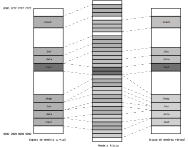

Bibliotecas
***********

As bibliotecas são ficheiros com código compilado
passível de ser reutilizado na produção de programas.
Se o código em biblioteca for incorporado no ficheiro objeto executável,
designa-se por ligação estática.
Se o código em biblioteca for carregado em memória,
apenas quando for invocado pela aplicação,
designa-se por ligação dinâmica.

.. list-table:: Title
   :widths: 25 25 25
   :header-rows: 1

   * -
     - Ligação estática
     - Ligação dinâmica
   * - Vantagens
     - * Execução mais rápida.
     - * Ficheiros objeto executáveis menores.
       * Em caso de atualização da biblioteca não é necessário gerar novamente aplicação.
       * Permite que o mesmo código seja usado por várias aplicações em simultâneo.
   * - Desvantagens
     - * Os ficheiros objeto executáveis são mais longos.
       * Em caso de atualização é necessário gerar novamente a aplicação.
     - * O tempo de procura da biblioteca e a resolução de símbolos afeta o tempo de execução do programa.

Tomemos como exemplo os ficheiros ``stack.c`` e ``fifo.c``
que implementam estruturas para armazenamento de conjuntos de números.

As soluções de programação utilizadas são escolhidas com o fim de exemplificar situações técnicas
e não por utilidade do código, eficiência ou elegância.

+-----------------------------------------------------------------+--------------------------------------------------------------+
| .. literalinclude:: ../../../code/libraries/libdemo/stack.h     | .. literalinclude:: ../../../code/libraries/libdemo/stack.c  |
|    :language: c                                                 |    :language: c                                              |
|    :caption: stack.h                                            |    :caption: stack.c                                         |
+-----------------------------------------------------------------+--------------------------------------------------------------+

+-----------------------------------------------------------------+--------------------------------------------------------------+
| .. literalinclude:: ../../../code/libraries/libdemo/fifo.h      | .. literalinclude:: ../../../code/libraries/libdemo/fifo.c   |
|    :language: c                                                 |    :language: c                                              |
|    :caption: fifo .h                                            |    :caption: fifo.c                                          |
+-----------------------------------------------------------------+--------------------------------------------------------------+

Considere-se o seguinte programa de aplicação:

.. literalinclude:: ../../../code/libraries/libdemo/main.c
   :language: c
   :caption: main.c
   :lines: -10,12,15,17,19-

**Exercício**

Gerar o executável sem criar biblioteca.

Convenção de nome
=================

As bibliotecas são armazenadas em ficheiros com nomes da forma:
``libxxx.so`` ou ``libxxx.a``.
Os ficheiros terminados em ``.a`` contém bibliotecas de ligação estática
e os terminadas em ``.so`` contém ficheiros de ligação dinâmica.
A sequência ``xxx`` é diferenciadora e identifica a biblioteca.

Biblioteca de ligação estática
==============================

Criação
-------
Uma biblioteca estática pode ser vista como um ficheiro de arquivo contendo vários objetos relocalizáveis. 

::

   $ ar cr libdemo.a stack.o fifo.o

Verificação
...........

::

   $ nm libdemo.a

Quando um símbolo definido numa biblioteca é referido,
todo o código incluído no ficheiro a que pertence esse símbolo
é incluído no ficheiro objeto executável.
Por exemplo, se no programa de exemplo se remover a referência a ``stack_pop``,
o respetivo código continua a ser incluído no executável final
porque a referência a ``stack_push`` se mantém.

Para evitar o crescimento dos ficheiros objeto com código não utilizado,
é comum separarem-se as função da biblioteca por vários ficheiro fonte.

Utilização
----------

Usar uma biblioteca estática é parecido com a ligação de vários ficheiros objeto relocalizáveis.

::

$ gcc main.o libdemo.a -o main

O código em biblioteca é copiado para o ficheiro objeto executável.
Em caso de alteração do código da biblioteca, por funcionalidade ou correção de erros,
é necessário gerar novamente o ficheiro objeto executável.

**Exercício**

Suprimir a referência à função ``stack_top``.
Verificar a manutenção do código dessa função como conteúdo do executável.

Suprimir as referências às funções ``fifo_insert`` e ``fifo_remove``.
Verificar a supressão do código dessas funções do conteúdo do executável.

Biblioteca de ligação dinâmica
==============================

Criação
-------

Os módulos que constituem a biblioteca são compilados em separado com a opção ``-fpic``.
Esta opção dá indicação ao compilador para gerar código que executa
independentemente do endereço de memória onde for carregado.

::

$ gcc -c -fpic stack.c fifo.c

O ficheiro a que chamamos biblioteca é gerado com o seguinte comando.

::

$ gcc -shared -o libdemo.so stack.o fifo.o

O ficheiro produzido (``libdemo.so``) é designado por *shared object*.
Contém o código e a informação necessária para ser carregado em memória
e integrar aplicações.

Utilização
----------

Geração do programa executável:

::

$ gcc main.c libdemo.so -o main

ou

::

$ gcc main.c -ldemo -L. -o main

Na primeira forma o ficheiro da biblioteca é indicado explicitamnete.

Na segunda forma é o *linker* (``ld``) que vai selecionar o ficheiro a utilizar.
O *linker* dá preferência à ligação dinâmica (``libdemo.so``).
Aplica ligação estática (usa ``libdemo.a``) se a opção ``-static`` for indicada
ou se a versão dinâmica (``libdemo.so``) não existir.

Na ligação dinâmica o *linker* incorpora no ficheiro objeto executável
meios de referência aos objetos da biblioteca, mas não o código da biblioteca.

A chamada das funções da biblioteca são realizadas indiretamente via PLT.

O código da biblioteca é carregado em memória
no momento da execução do programa se ainda não tiver sido carregado,
na sequência do arranque de outro processo.

Dependências
------------

No ficheiro objeto executável ficam registados os nomes de versão (**soname**)
das bibliotecas necessária para a sua execução.
O utilitário ``ldd`` permite verificar estas dependências
e se estão acessíveis para carregamento.

::

   $ ldd main
   	linux-vdso.so.1 (0x00007ffed3342000)
   	libdemo.so => not found
   	libc.so.6 => /lib/x86_64-linux-gnu/libc.so.6 (0x00007de11b400000)
   	/lib64/ld-linux-x86-64.so.2 (0x00007de11b788000)

Quando o programa for a executar o *loader* procura
as bibliotecas no sistema de ficheiros por esta ordem:

   #. No *path* incluído no executável definido pela opção ``-rpath``;
      Incluir um *path* de pesquisa no próprio executável:

      .. code-block:: console

         $ gcc main.o -L. -ldemo -Wl,-rpath,/home/ezequiel/lib -o main 

   #. Nas diretorias indicadas na variável de ambiente ``LD_LIBRARY_PATH``;

      .. code-block:: console

         $ export LD_LIBRARY_PATH=/usr/ezequiel/lib

   #. Na *cache* -- ficheiro ``/etc/ld.so.cache``.
      A *cache* é atualizada pelo utilitário ``ldconfig``,
      que introduz os caminhos definidos nos ficheiros ``/etc/ld.so.conf.d/*.conf``,
      as diretorias ``/lib`` e ``/usr/lib`` ou definidos na linha de comando.
      
      * Visualizar ``/etc/ld.so.conf.d/*.conf``
      
         .. code-block:: console

            $ cat  /etc/ld.so.conf.d/*.conf
            
            /usr/lib/x86_64-linux-gnu/libfakeroot
            # Multiarch support
            /usr/local/lib/i386-linux-gnu
            /lib/i386-linux-gnu
            /usr/lib/i386-linux-gnu
            /usr/local/lib/i686-linux-gnu
            /lib/i686-linux-gnu
            /usr/lib/i686-linux-gnu
            # libc default configuration
            /usr/local/lib
            # Multiarch support
            /usr/local/lib/x86_64-linux-gnu
            /lib/x86_64-linux-gnu
            /usr/lib/x86_64-linux-gnu

      * Acrescentar um caminho de pesquisa na *cache*
      
         .. code-block:: console
         
            $ sudo ldconfig /home/ezequiel/lib

      * Verificar se o caminho está na *cache*
      
         .. code-block:: console
         
            $ ldconfig -p | grep libdemo.so

      * Eliminar caminhos da *cache*.
        Remover o caminho do ficheiro ``/etc/ld.so.conf.d/*.conf``
        em seguida executar o comando abaixo. Os caminhos acrescentados
        pela linha de comando também serão eliminados.
      
         .. code-block:: console
         
            $ sudo ldconfig

Carregamento no arranque da aplicação
-------------------------------------
O *loader* carrega o programa e verifica se existe uma secção ``.interp`` com a indicação do *linker* dinâmico:

::

   $ readelf -x .interp main
 
   Hex dump of section '.interp':
     0x00000318 2f6c6962 36342f6c 642d6c69 6e75782d /lib64/ld-linux-
     0x00000328 7838362d 363

O *linker* dinâmico realiza as seguintes operações:

   #. Mapeia as secções de dados e de código
      das bibliotecas dinâmicas que vão ser utilizadas
      no espaço de memória do processo;

   #. Resolve as referências existentes no programa para dados e código das bibliotecas.
      Esta operação não utiliza o processo das *relocations* porque isso implicaria alterações de código.
      É resolvido via PLT/GOT.

   
SONAME
------

.. list-table:: Title
   :widths: 25 25 25

   * - Nome de ligação
       (*linker name*)
     - ``libXXX.so``
     - Corresponde geralmente a um link. É o nome que é usado para
       referenciar uma dada biblioteca na altura da geração do programa,
       sem definir a versão.

   * - Nome de versão
       (**soname**)
     - ``libXXX.so.N``
     - O N indica a versão de especificação da biblioteca.
       Muda de versão sempre que a interface da biblioteca se torna
       incompatível com as anteriores.
       Corresponde normalmente a um *link*.

   * - Nome real
     - ``libXXX.so.N.M.R``
     - Este é o ficheiro real onde se encontra o conteúdo da biblioteca.

**N** -- versão principal (*major number*); interface incompatível com outras versões

**M** -- versão secundária (*minor number*); interface diferente mas compatível com a versão principal.

**R** -- variante de implementação; modificações internas como correções de erros ou melhoramentos.

O objetivo deste esquema de nomes é facilitar as atualizações e lidar com várias versões.

Para incorporar a informação de versão (SONAME) na biblioteca deve ser usada a opção ``-soname``.

::

   $ gcc -shared -Wl,-soname,libdemo.so.1 -o libdemo.so.1.0.0 stack.o fifo.o

Verificar o SONAME da biblioteca.

::

   $ readelf -d libdemo.so.1.0.0 

   Dynamic section at offset 0x2e58 contains 18 entries:
     Tag        Type                         Name/Value
    0x000000000000000e (SONAME)             Library soname: [libdemo.so.1]
    0x000000000000000c (INIT)               0x1000
    0x000000000000000d (FINI)               0x11ac
    ...

Um executável que seja produzido com ligação a uma biblioteca com SONAME fica dependente desse SONAME.

::

   $ gcc main.c -ldemo -L. -o main

Verificar as dependências:

::

   $ readelf -d main

   Dynamic section at offset 0x2d98 contains 28 entries:
     Tag        Type                         Name/Value
    0x0000000000000001 (NEEDED)             Shared library: [libdemo.so.1]
    0x0000000000000001 (NEEDED)             Shared library: [libc.so.6]
    0x000000000000000c (INIT)               0x1000
    0x000000000000000d (FINI)               0x1274
    ...

pkg-config
----------

O utilitário ``pkg-config`` permite obter informação sobre bibliotecas instaladas.
Essa informação inclui as opções de compilação e de ligação necessárias
para utilizar uma dada biblioteca.

**Exemplo**

.. code-block:: console

   $ pkg-config glib-2.0 -libs

   -lglib-2.0 

Indica que para ligar com a biblioteca Glib deve ser incluida a opção ``-lglib-2`` na linha de comando do ``ld``.

.. code-block:: console

   $ pkg-config glib-2.0 -cflags

   -I/usr/include/glib-2.0 -I/usr/lib/x86_64-linux-gnu/glib-2.0/include 

Indica que para encontrar o ficheiro de inclusão da biblioteca Glib devem
ser usada as opções de compilação ``-I/usr/include/glib-2.0`` e ``-I/usr/lib/x86_64-linux-gnu/glib-2.0/include``.

A informação relativa a cada biblioteca é guardada em ficheiros com a extensão ``.pc``
que se encontram num dos seguintes locais:

.. code-block:: console

   $ find /usr/ -name "pkgconfig"

   /usr/share/pkgconfig
   /usr/local/lib/pkgconfig
   /usr/lib/pkgconfig
   /usr/lib/x86_64-linux-gnu/pkgconfig

.. code-block:: console

   $ ls -l /usr/lib/x86_64-linux-gnu/pkgconfig/

   total 432
   -rw-r--r-- 1 root root  283 mar 31  2024 alsa.pc
   -rw-r--r-- 1 root root  648 ago  9 03:33 dbus-1.pc
   -rw-r--r-- 1 root root  289 set 10 11:17 expat.pc
   -rw-r--r-- 1 root root  427 mar 31  2024 geany.pc
   -rw-r--r-- 1 root root  761 nov 13 17:42 gio-2.0.pc
   -rw-r--r-- 1 root root  211 nov 13 17:42 gio-unix-2.0.pc
   -rw-r--r-- 1 root root  522 nov 13 17:42 glib-2.0.pc

Nas linhas 18 e 20 pode-se ver a informação destinada a responder às perguntas ``-libs`` e ``cflag``.

.. code-block:: console
   :linenos:
   
   $ cat /usr/lib/x86_64-linux-gnu/pkgconfig/glib-2.0.pc 

   prefix=/usr
   bindir=${prefix}/bin
   datadir=${prefix}/share
   includedir=${prefix}/include
   libdir=${prefix}/lib/x86_64-linux-gnu
   
   glib_genmarshal=${bindir}/glib-genmarshal
   gobject_query=${bindir}/gobject-query
   glib_mkenums=${bindir}/glib-mkenums
   glib_valgrind_suppressions=${datadir}/glib-2.0/valgrind/glib.supp
   
   Name: GLib
   Description: C Utility Library
   Version: 2.80.0
   Requires.private: libpcre2-8 >= 10.32
   Libs: -L${libdir} -lglib-2.0
   Libs.private: -lm -pthread
   Cflags: -I${includedir}/glib-2.0 -I${libdir}/glib-2.0/include

Carregamento em execução
------------------------

Uma biblioteca de ligação dinâmica pode ser carregada em qualquer altura da execução
da uma aplicação -- não apenas no momento do arranque da aplicação. 

API para carregamento de bibliotecas em tempo de execução:

.. code-block:: c

   #include <dfcn.h> 
   void *dlopen(const char *filename, int flags);
   void *dlsym(void *handle, char *symbol);
   int dlclose(void *handle);
   const char *dlerror(void);

``dlopen`` -- carrega a biblioteca indicada por filename e invoca o *linker* dinâmico
para resolver referências a símbolos externos,
definidos noutras bibliotecas ou no programa executável.
Para que os símbolos definidos numa biblioteca fiquem disponíveis,
essa biblioteca deve ter sido carregada com a *flag* RTLD_GLOBAL.
Para que os símbolos definidos no programa executável fiquem disponíveis,
esse executável deve ter sido criado com a opção ``-rdynamic``.

``dlsym`` -- recebe a referência para uma biblioteca previamente carregada com ``dlopen``
e o nome de um símbolo e retorna o endereço de memória desse símbolo.

``dlclose`` -- descarrega uma biblioteca previamente carregada com ``dlopen``.

``dlerror`` -- retorna uma *string* com a descrição do erro mais recente.

**Exemplo**

Fonte do programa executável:

.. literalinclude:: ../../../code/dlopen/lib_func/main.c
   :language: c
   :caption: main.c

Para gerar o executável:

.. code-block:: console

   $ gcc main.c -ldl -o main

Fonte do programa em biblioteca:

.. literalinclude:: ../../../code/dlopen/lib_func/lib_func.c
   :language: c
   :caption: lib_func.c

Geração da biblioteca de ligação dinâmica:

.. code-block:: console

   $ gcc -fpic lib_func.c -shared -o lib_func.so

**1ª experiência**

.. code-block:: console

   $ ./main
   usage: ./main libXXX.so

Não foi indicado o ficheiro da biblioteca.

**2ª experiência**

.. code-block:: console

   $ ./main lib_func.so

   lib_func.so: cannot open shared object file: No such file or directory

O ficheiro da biblioteca não foi encontrado
porque a diretoria corrente não se encontra nos caminhos de procura de bibliotecas.

3ª experência

.. code-block:: console

   $ export LD_LIBRAY_PATH=.
   $ ./main lib_func.so
   Calling lib_func
   Executing lib_func
   lib_func returned 77

**Exemplo**

Habilitar o programa de simulação de fila de espera para aceitar
a incorporação de novos comandos através da ligação dinâmica em execução (*plugin*).

:numref:`data_structures_double_link_list`

Os comandos do programa são agrupados numa lista ligada em que a informação relativa
a cada comando é composta pelo ponteiro para a função que executa o comando,
a descrição textual do comando e a letra identificadora.

.. literalinclude:: ../../../code/dlopen/wqueue/wqueue.c
   :language: c
   :lines: 101-133
   :caption: wqueue.c
   
A incorporação de novo comando é realizada pela função ``commando_new``.
Esta função recebe o nome do ficheiro contendo o *shared object*
e extrai através da função ``dlsym`` os ponteiros para os elementos do novo comando.

A partir do momento em que estes elementos são inseridos na lista de comandos,
o novo comando passa a estar disponível, a par dos comandos originais.

.. literalinclude:: ../../../code/dlopen/wqueue/wqueue.c
   :language: c
   :lines: 135-160
   :caption: wqueue.c

O executável é gerado sob o controlo do seguinte *makefile*:

.. literalinclude:: ../../../code/dlopen/wqueue/makefile
   :linenos:
   :caption: makefile

A criação de um novo comando consiste em gerar um *shared object*
contendo os elementos do novo comando: a função que executa o comando,
a descrição textual e a letra identificadora.

Em seguida exemplifica-se a criação de um comando para vazar a fila de espera.

.. literalinclude:: ../../../code/dlopen/wqueue/toempty.c
   :language: c
   :caption: toempty.c

Os elementos do comando são obrigatoriamente designados pelos símbolos 
``command_function``, ``command_letter`` e ``command_description``,
pois serão estes os símbolos utilizados por parte do programa executável,
ao invocar a função ``dlsym`` (linhas 40, 45 e 50).

O *shared object* é gerado sob o controlo do seguinte *makefile*:

.. literalinclude:: ../../../code/dlopen/wqueue/makelib
   :linenos:
   :caption: makelib

**1ª experiência**

Remover a opção ``-rdynamic`` da linha de geração do executável ``wqueue``.

.. code-block:: console

   $ ./wqueue
   
   >c ./libtoempty.so
   ./libtoempty.so: undefined symbol: queue
   >
   
Este erro deve-se ao programa executável, por omissão,
não exportar símbolos para ligação dinâmica com os *shared objects*.
A referência indefinida ao símbolo externo ``queue``,
existente em ``libtoempty.so``, não poder ser resolvida pelo *linker* dinâmico.

.. code-block:: console

   $ readelf --dyn-syms libtoempty.so
   
   Symbol table '.dynsym' contains 10 entries:
      Num:    Value          Size Type    Bind   Vis      Ndx Name
   	...
        4: 0000000000000000     0 NOTYPE  GLOBAL DEFAULT  UND queue
  	...

O símbolo ``queue``, definido no programa executável,
só fica disponível para ligação dinâmica,
se o executável for gerado com a opção ``-rdynamic`` (linha 4 do makefile).

Nessa altura todos os símbolos globais são incluídos na tabela de símbolos de ligação dinâmica.

.. code-block:: console

   $ readelf --dyn-syms wqueue

   Symbol table '.dynsym' contains 40 entries:
      Num:    Value          Size Type    Bind   Vis      Ndx Name
   	...	
       27: 0000000000004010    24 OBJECT  GLOBAL DEFAULT   25 queue
   	...

**2ª experiência**

Depois de o programa executável ser produzido com a opção ``-rsymbol``,
a ligação dinâmica do símbolo ``queue`` sucede bem e o código acabado de carregar pode ser utilizado.

.. code-block:: console

   $ ./wqueue

   >c libtoempty.so
   >h
   k        - Eliminar todos os utentes da fila de espera
   n <nome> - Chegada de novo utente
   a        - Atender utente
   l        - Listar fila de espera
   d <nome> - Desistencia de utente
   c        - Incorporar novo comando
   h        - Listar os comandos existentes
   s        - Sair
   >

Algoritmo do *linker*
=====================

Os símbolos definidos em bibliotecas são ignorados
se na altura do processamento da biblioteca ainda não existirem referências para eles.

Por essa razão as bibliotecas são colocadas, na linha de comando, depois dos ficheiros objeto.

**Exercício**

Inverter a ordem de colocação da biblioteca em relação ao objeto ``main.o``.

.. code-block:: console

$ gcc libdemo.a main.o -o main

Referências
===========
