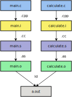
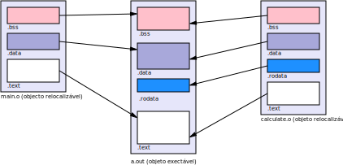
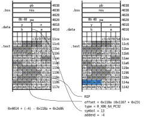
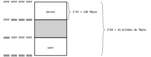

*Linking*
*********

Compilação separada
===================

A partição dos programas por vários ficheiros é uma prática necessária na produção,
na manutenção e na reutilização de *software*.

Em programas extensos, alterações de código fonte num ficheiro
não implica a necessidade de recompilar a totalidade dos ficheiros do projeto.

Unidade de tradução
-------------------

O compilador compila um ficheiro fonte de cada vez. Neste contexo o ficheiro é designado por unidade de tradução.
Uma unidade de tradução é formada por uma sequência de definições externas -- variáveis ou funções.
Externas porque são globalmente acessíveis, podem ser usadas por funções definidas nesta
ou noutras unidades de tradução.

As variáveis definidas dentro de funções são internas.

Uma parte de um programa, numa unidade de tradução,
interage com outra parte do programa, noutra unidade de tradução,
através de variáveis ou funções.
As variáveis ou funções são identificadas por **símbolos** (o nome da variável ou da função).

O resultado da tradução é um ficheiro objeto relocalizável.

Declaração
----------

Declarar uma variável ou função consiste em anunciar as suas caraterísticas.

``extern int z;`` -- declara que ``z`` é uma variável do tipo ``int`` de âmbito externo.

``size_t strlen(const char *str);`` -- declara que ``strlen`` é uma função
que recebe como argumento um ponteiros para ``char`` e devolve um valor do tipo ``size_t``.

As suas definições encontram-se noutro local. Pode ser noutro ou no mesmo ficheiro.

Definição
---------

Definir uma variável ou função significa anunciar a sua exitência
e implica ocupar espaço de memória para a alojar.

No caso das variáveis, a definição pode vir acompanhada da definição do valor inicial.
Implica reservar memória da dimensão adequada ao tipo.

Por exemplo a seguinte definição reserva quatro bytes na secção ``.data``,
preencidos com os valores 0x21 0x00 0x00 0x00. ::

   int z = 33;

No caso das funções, a definição provoca a geração do código máquina que determina
o seu comportamento e a respetiva reserva de espaço de memória.

Por exemplo, a seguinte definição da função ``strlen`` implica reservar na secção ``.text``
uma porção de 28 bytes preenchidos com o código binário das instruções.

+------------------------------------------------------+------------------------------------------------------+
| .. literalinclude:: ../../../code/linking/strlen.c   | .. literalinclude:: ../../../code/linking/strlen.s   |
|    :language: c                                      |    :language: asm                                    |
|                                                      |    :lines: 4-16                                      |
+------------------------------------------------------+------------------------------------------------------+

Uma definição também é uma declaração.

Âmbito
------

O âmbito dos símbolos -- que identificam as variáveis e as funções -- pode ser
**bloco**, **função**, **unidade de tradução** (ficheiro) ou **global** (de todo o programa).

A utilização do mesmo símbolo numa declaração mais interior
esconde uma declaração mais exterior desse mesmo símbolo.

A uma declaração está associada um *storage class*: automático ou estático.
O *storage class* depende dos especificadores ``static``, ``extern`` ou do local da declaração.

Uma declaração diz-se externa se estiver fora de uma função (linha 1)
ou for precedida do especificador ``extern`` (linha 4).

   .. code-block:: c
      :emphasize-lines: 1,4
      :linenos:
      
      int i;

      int main() {
          extern int j;
      }
   
   
Numa declaração interna o atributo ``static`` significa que a variável vai ser alojada num local permanente da memória (linha 2).

   .. code-block:: c
      :emphasize-lines: 2
      :linenos:

      int main() {
          static int i;
      }

Visibilidade
------------

Para que um símbolo, definido num módulo, possa ser referenciado noutro módulo,
é necessário que seja classificado como globalmente visível.

Na linguagem C, por omissão, uma definição externa produz um símbolo globalmente visível (símbolo global).
Para restringir a visibilidade de um símbolo ao ficheiro onde é definido,
usa-se o especificador ``static`` (linha 2).

   .. code-block:: c
      :emphasize-lines: 2
      :linenos:
   
      int c;
      static int j;
      int main() {
          int b;
      }

Na linguagem assembly GNU, por omissão, um símbolo é visível apenas no ficheiro onde é definido.
Para o tornar globalmente visível é necessário explicitar através da diretiva
``.global`` como no seguinte exemplo:

   .. code-block:: c
      :emphasize-lines: 1
      :linenos:

              .global    main
      main:

Um símbolo global precisa ser conhecido no ficheiro onde é referenciado.
O AS (nome do *assembler* GNU) assume que um símbolo referenciado
e não definido no presente ficheiro é global e está definido noutro ficheiro.

As declarações são escritas em ficheiros com extensão **h**,
que por sua vez são intercalados pela diretiva #include nos ficheiros fonte,
a fim de dar a conhecer as propriedades dos objetos.

Secções de dados
----------------

O compilador **gcc** da GNU aloja as variáveis externas, ou locais com atributo ``static``,
nas secções ``.bss``, ``.data`` ou ``.rodata``, de acordo com certas propriedades. 

   ``.bss`` -- Variáveis inicializadas com zero.
      
   ``.data`` -- Variáveis inicializadas com valores diferentes de zero.
   
   ``.rodata`` -- Variáveis com atributo ``const`` e *strings* literais.
      
   .. code-block :: c
      :emphasize-lines: 2,4,6,8,10,15,17,19
      :linenos:

      int a;                               .bss - 4 bytes
      static int b;                        .bss - 4 bytes
      int x = 20;                          .data - 4 bytes
      static int y = 24;                   .data - 4 bytes
      int array[5];                        .bss - 20 bytes
      int table[] = {1, 2, 3, 4, 5};       .data - 20 bytes
      char matrix[100][20];                .bss - 2000 bytes
      char n[] = "Manuel";                 .data - 7 bytes
      const char m[] = "Joaquim";          .rodata - 8 bytes
      const char *d = "Rita";              .data - 8 bytes   .rodata - 5 bytes
      const char *const f = "Ezequiel";    .rodata - 8 + 9 bytes

      void function()
      {
          int j;                           registo ou *stack* 
          int k = 34;                      registo ou *stack*
          register int l;                  preferencialmente registo ou *stack*
          const int m = 20;                registo ou *stack*
          static const int n = 20;         .rodata
          static int o = 55;               .data 
      }

Processo de compilação
----------------------

Considere-se como exemplo um programa constituído pelos módulos: ``main.c`` e ``calculate.c``.

+------------------------------------------------------+--------------------------------------------------------+
| .. literalinclude:: ../../../code/linking/main.c     | .. literalinclude:: ../../../code/linking/calculate.c  |
|    :language: c                                      |    :language: c                                        |
|                                                      |                                                        |
+------------------------------------------------------+--------------------------------------------------------+

Numa única invocação, o **gcc** pode processar vários ficheiros fonte e produzir o executável. ::

$ gcc main.c add.c -o main

Efetivamente, o programa **gcc** não é o compilador de linguagem C, é um *compiler driver*.
No processo de geração do executável o **gcc** invoca sucessivamente,
para cada ficheiro fonte:

#. O pré-processador ::

   $ cpp <outros argumentos> -c main.c -o main.i

#. O compilador de linguagem C ::

   $ cc <outros argumentos> -S main.i -o main.s

#. O *assembler* ::

   $ as <outros argumentos> -S main.s -o main.o

No final invoca o linker com todos os ficheiros objeto relocalizáveis. ::

   $ ld <outros argumentos> crt1.o *.o main.o add.o -o main

O método designado por **compilação separada** consiste em invocar
os tradutores individualmente (cpp, cc, as) para cada ficheiro fonte,
produzindo o respetivo ficheiro objeto relocalizável (com a extensão ``*.o``).

   Ilustração do processo de compilação e ligação
   
Ficheiro objeto relocalizável
-----------------------------

Em última instância, o ficheiro objeto relocalizável é produzido pelo *assembler*
e é-lhe dada a extensão ``o``. Pode ter tido origem num programa fonte em linguagem C ou em linguagel *assembly*.

Nos sistemas Linux atuais os ficheiros objeto relocalizáveis e os objetos executáveis,
utilizam o formato ELF [#f1]_.
O seu conteúdo é essencialmente composto por um cabeçalho e um conjunto de blocos que se designam por secções que contêm o binário do programa e outras informações.

Secções
.......

.. code-block:: console

   $ readelf -S calculate.o

   There are 16 section headers, starting at offset 0x490:

   Section Headers:
     [Nr] Name              Type             Address           Offset
          Size              EntSize          Flags  Link  Info  Align
     [ 0]                   NULL             0000000000000000  00000000
          0000000000000000  0000000000000000           0     0     0
     [ 1] .text             PROGBITS         0000000000000000  00000040
          000000000000006b  0000000000000000  AX       0     0     1
     [ 2] .rela.text        RELA             0000000000000000  00000318
          00000000000000a8  0000000000000018   I      13     1     8
     [ 3] .data             PROGBITS         0000000000000000  000000ac
          0000000000000004  0000000000000000  WA       0     0     4
     [ 4] .bss              NOBITS           0000000000000000  000000b0
          0000000000000010  0000000000000000  WA       0     0     8
     [ 5] .rodata           PROGBITS         0000000000000000  000000b0
          0000000000000004  0000000000000000   A       0     0     4
     [ 6] .data.rel         PROGBITS         0000000000000000  000000b8
          0000000000000008  0000000000000000  WA       0     0     8
     [ 7] .rela.data.rel    RELA             0000000000000000  000003c0
          0000000000000018  0000000000000018   I      13     6     8
     [ 8] .comment          PROGBITS         0000000000000000  000000c0
          0000000000000027  0000000000000001  MS       0     0     1
     [ 9] .note.GNU-stack   PROGBITS         0000000000000000  000000e7
          0000000000000000  0000000000000000           0     0     1
     [10] .note.gnu.pr[...] NOTE             0000000000000000  000000e8
          0000000000000050  0000000000000000   A       0     0     8
     [11] .eh_frame         PROGBITS         0000000000000000  00000138
          0000000000000060  0000000000000000   A       0     0     8
     [12] .rela.eh_frame    RELA             0000000000000000  000003d8
          0000000000000030  0000000000000018   I      13    11     8
     [13] .symtab           SYMTAB           0000000000000000  00000198
          0000000000000150  0000000000000018          14     9     8
     [14] .strtab           STRTAB           0000000000000000  000002e8
          000000000000002c  0000000000000000           0     0     1
     [15] .shstrtab         STRTAB           0000000000000000  00000408
          0000000000000083  0000000000000000           0     0     1

``.text`` binário das instruções assembly;

``.rela.text`` locais na secção ``.text`` que precisam ser atualizadas na ligação;

``.data`` variáveis com valor inicial definido e determinável em compilação;

``.data.rel`` variáveis com valor inicial definido determinado em ligação;

``.rela.data.rel`` locais na secção ``.data.rel`` que precisam ser atualizadas na ligação;

``.bss`` variáveis com valor inicial zero;

``.rodata`` dados apenas de leitura -- constantes, *strings*;

``.symtab`` tabela de símbolos -- nome das funções e variáveis, definidas e invocadas;

``.strtab`` tabela de *strings* com o nome dos símbolos;

``.shstrtab`` tabela de *strings* usadas nos cabeçalhos de secções.

Símbolos
........

 .. code-block:: console

   $ readelf -s calculate.o
   
   Symbol table '.symtab' contains 14 entries:
      Num:    Value          Size Type    Bind   Vis      Ndx Name
        0: 0000000000000000     0 NOTYPE  LOCAL  DEFAULT  UND 
        1: 0000000000000000     0 FILE    LOCAL  DEFAULT  ABS calculate.c
        2: 0000000000000000     0 SECTION LOCAL  DEFAULT    1 .text
        3: 0000000000000000     0 SECTION LOCAL  DEFAULT    4 .bss
        4: 0000000000000000     4 OBJECT  LOCAL  DEFAULT    5 x
        5: 0000000000000000     0 SECTION LOCAL  DEFAULT    6 .data.rel
        6: 0000000000000000     8 OBJECT  LOCAL  DEFAULT    6 pa
        7: 0000000000000008     8 OBJECT  LOCAL  DEFAULT    4 pb
        8: 0000000000000000    23 FUNC    LOCAL  DEFAULT    1 multiply
        9: 0000000000000000     4 OBJECT  GLOBAL DEFAULT    3 y
       10: 0000000000000000     0 NOTYPE  GLOBAL DEFAULT  UND a
       11: 0000000000000000     4 OBJECT  GLOBAL DEFAULT    4 res
       12: 0000000000000017    84 FUNC    GLOBAL DEFAULT    1 calculate
       13: 0000000000000000     0 NOTYPE  GLOBAL DEFAULT  UND b

Detalhe dos símbolos: posição relativa ao início da secção a que pertencem (``Value``),
dimensão (``Size``); tipo função (``FUNC``) ou variável (``OBJECT``);
âmbito local ou global (``Bind``), secção a que pertence (``Ndx``),
e nome do símbolo (``Name``).

Outra forma de visualizar os símbolos de um módulo:

 .. code-block:: console

   $ nm calculate.o
   
                    U a
                    U b
   0000000000000017 T calculate
   0000000000000000 t multiply
   0000000000000000 d pa
   0000000000000008 b pb
   0000000000000000 B res
   0000000000000000 r x
   0000000000000000 D y

Símbolos locais definidos e invocados apenas neste ficheiro -- ``multiply``, ``pa``, ``pb``, ``x``.

Símbolos globais definidos em ``calculate.c`` e eventualmente referidos de outros ficheiros -- ``calculate``, ``res``, ``y``.

Símbolos globais referidos em ``calculate.c`` -- ``a``, ``b``.

Os símbolos são representados no ficheiro objeto pela estrutura ``Elf64_Sym``.

.. code-block :: c  
     
   typedef struct {
       Elf64_Word    st_name;   Índice na tabela de strings com o nome dos símbolos
       unsigned char st_info;   Bits 0 a 3 - âmbito local ou global; bit 4 a 7 - tipo OBJECT, FUNC
       unsigned char st_other;  Reservado
       Elf64_Half    st_shndx;  Secção onde é definido (há três casos especiais ABS, COM , UND)
       Elf64_Addr    st_value;  Valor associado ao símbolo (endereço de memória ou offset)
       Elf64_Xword   st_size;   Dimensão de memória que ocupa
   } Elf64_Sym;

Visualização em hexadecimal da tabela de símbolos.
Os dados entre as posições 0xc0 e 0xd7 correspondem ao símbolo ``multiply``.

 .. code-block:: console

   $ readelf -x .symtab calculate.o
   
   Hex dump of section '.symtab':
     0x00000000 00000000 00000000 00000000 00000000 ................
     0x00000010 00000000 00000000 01000000 0400f1ff ................
     0x00000020 00000000 00000000 00000000 00000000 ................
     0x00000030 00000000 03000100 00000000 00000000 ................
     0x00000040 00000000 00000000 00000000 03000400 ................
     0x00000050 00000000 00000000 00000000 00000000 ................
     0x00000060 0d000000 01000500 00000000 00000000 ................
     0x00000070 04000000 00000000 00000000 03000600 ................
     0x00000080 00000000 00000000 00000000 00000000 ................
     0x00000090 0f000000 01000600 00000000 00000000 ................
     0x000000a0 08000000 00000000 12000000 01000400 ................
     0x000000b0 08000000 00000000 08000000 00000000 ................
     0x000000c0 15000000 02000100 00000000 00000000 ................
     0x000000d0 17000000 00000000 1c000000 11000300 ................
     0x000000e0 00000000 00000000 04000000 00000000 ................
     0x000000f0 10000000 10000000 00000000 00000000 ................
     0x00000100 00000000 00000000 1e000000 11000400 ................
     0x00000110 00000000 00000000 04000000 00000000 ................
     0x00000120 22000000 12000100 17000000 00000000 "...............
     0x00000130 54000000 00000000 13000000 10000000 T...............
     0x00000140 00000000 00000000 00000000 00000000 ................
   
.. code-block:: console
   
   $ readelf -x .strtab calculate.o
   
   Hex dump of section '.strtab':
     0x00000000 0063616c 63756c61 74652e63 00780070 .calculate.c.x.p
     0x00000010 61007062 006d756c 7469706c 79007265 a.pb.multiply.re
     0x00000020 73006361 6c63756c 61746500          s.calculate.

Ligação (*linking*)
===================

A operação de ligação é realizada em duas fase:

    #. **resolução de símbolos** -- a cada referência corresponde apenas uma definição;

    #. **relocalização** -- calcula endereços dos símbolos e completa o código binário.

Resolução de símbolos
---------------------

Consiste em encontrar a única definição para cada símbolo.

Nos símbolos locais isso é realizado pelo compilador -- símbolos com ligação interna.

Nas resolução de símbolos de ligação externa,
pode acontecer a definição do símbolo não existir ou existirem múltiplas definições.

Neste segundo caso a resolução poderá ter êxito se:

   * existir apenas uma definição forte devendo as outras ser fracas;

   * haver só definições fracas -- neste caso escolher uma qualquer.

Relocalização
-------------
A relocalização começa depois de se conhecerem todas as definições de símbolos
e engloba as seguintes operações:

   #. agregar todas as secções do mesmo tipo definidas nos ficheiros numa única secção de saída;

   #. calcular e associar a cada símbolo o endereço de execução;

   #. modificar o conteúdo das secções nos locais indicados na respetiva tabela de relocalização.

Quando o *assembler* codifica uma instrução com referência a um símbolo,
não sabe a localização final dessa instrução,
nem a localização do símbolo referido.
Nessa altura gera uma *relocation entrie*.

.. code-block:: console

   $ objdump  -d -r calculate.o
   
   calculate.o:     file format elf64-x86-64
   
   
   Disassembly of section .text:
   
   0000000000000000 <multiply>:
      0:	f3 0f 1e fa          	endbr64
      4:	55                   	push   %rbp
      5:	48 89 e5             	mov    %rsp,%rbp
      8:	89 7d fc             	mov    %edi,-0x4(%rbp)
      b:	89 75 f8             	mov    %esi,-0x8(%rbp)
      e:	8b 45 fc             	mov    -0x4(%rbp),%eax
     11:	0f af 45 f8          	imul   -0x8(%rbp),%eax
     15:	5d                   	pop    %rbp
     16:	c3                   	ret
   
   0000000000000017 <calculate>:
     17:	f3 0f 1e fa          	endbr64
     1b:	55                   	push   %rbp
     1c:	48 89 e5             	mov    %rsp,%rbp
     1f:	53                   	push   %rbx
     20:	48 8d 05 00 00 00 00 	lea    0x0(%rip),%rax        # 27 <calculate+0x10>
   			23: R_X86_64_PC32	b-0x4
     27:	48 89 05 00 00 00 00 	mov    %rax,0x0(%rip)        # 2e <calculate+0x17>
   			2a: R_X86_64_PC32	.bss+0x4
     2e:	48 8b 05 00 00 00 00 	mov    0x0(%rip),%rax        # 35 <calculate+0x1e>
   			31: R_X86_64_PC32	.data.rel-0x4
     35:	8b 10                	mov    (%rax),%edx
     37:	48 8b 05 00 00 00 00 	mov    0x0(%rip),%rax        # 3e <calculate+0x27>
   			3a: R_X86_64_PC32	.bss+0x4
     3e:	8b 00                	mov    (%rax),%eax
     40:	8d 1c 02             	lea    (%rdx,%rax,1),%ebx
     43:	8b 05 00 00 00 00    	mov    0x0(%rip),%eax        # 49 <calculate+0x32>
   			45: R_X86_64_PC32	y-0x4
     49:	ba e8 03 00 00       	mov    $0x3e8,%edx
     4e:	89 c6                	mov    %eax,%esi
     50:	89 d7                	mov    %edx,%edi
     52:	e8 a9 ff ff ff       	call   0 <multiply>
     57:	01 d8                	add    %ebx,%eax
     59:	89 05 00 00 00 00    	mov    %eax,0x0(%rip)        # 5f <calculate+0x48>
   			5b: R_X86_64_PC32	res-0x4
     5f:	8b 05 00 00 00 00    	mov    0x0(%rip),%eax        # 65 <calculate+0x4e>
   			61: R_X86_64_PC32	res-0x4
     65:	48 8b 5d f8          	mov    -0x8(%rbp),%rbx
     69:	c9                   	leave
     6a:	c3                   	ret
   
A instrução localizada no endereço ``20`` ``lea 0x0(%rip),%rax`` tem associada uma relocalização
para atualizar o *offset* relativo ao PC (``R_X86_64_PC32``) para acesso à variável ``b``.

A instrução localizada no endereço ``43`` ``mov    0x0(%rip),%eax`` tem associada uma relocalização
para atualizar o *offset* relativo ao PC (``R_X86_64_PC32``) para acesso à variável ``y``.

Algoritmo de relocalização
==========================

::

   foreach section s {
   	foreach relocation entry r {
   		ptr = s + r.offset   local do ficheiro onde é preciso afetar
   		if (r.type ==  R_X86_64_PC32) {
   			address = address(s) + r.offset;	endereço de execução
   			*ptr = adress(r.symbol) + r.addend – address;
   		}
   		if (r.type ==  R_X86_64_64)
   			*ptr = adress(r.symbol) + r.addend;
   }	}

A referência ao símbolo ``multiply`` é resolvida pelo próprio compilador.
Como se trata de um símbolo interno, com endereçamento relativo,
a distância do ponto de referência (endereço 0x57) ao endereço da função (0x0)
é -87 (0xffffffa9).
Também pode ser confirmado utilizando os endereços finais:

   * Endereço de referência = 0x11be
   * Endereço da função ``multiply`` = 0x1167
   * Diferença de endereços = 0x11be - 0x1167 = 0x57
 
Ficheiro objeto executável
==========================

O ficheiro objeto executável contém toda a informação necessária
para carregar o programa em memória antes de ser executado.
As secções e os símbolos têm agora posições definidas
e as referências a símbolos estão preenchidas (foram preenchidas através das *relocations*).

.. code-block:: console

   $ objdump -h a.out
   
.. literalinclude:: ../../../code/linking/objdump_h_a_out

Execução de programas em Linux
==============================

Na arquitetura x86_64 os endereços de memória são definidos com 64 bits.
As implementações atuais desta arquitetura, dos 64 bits de endereço,
apenas utilizam 48 bits em endereço virtual e cerca de 40 bits em endereço físico.

No sistema operativo Linux,
a primeira metade do espaço de endereçamento virtual ``0000 0000 0000 0000 – 7fff ffff ffff``
é usada para processos e a segunda metade
``ffff 8000 0000 0000 – ffff ffff ffff ffff`` é usada pelo *kernel*.

Ao lançar um processo, o Linux faz a seguinte ocupação do espaço de endereçamento virtual:

.. code-block:: console

   $ cat /proc/self/maps

   652deccb2000-652deccb4000 r--p 00000000 103:02 30933476 /usr/bin/cat
   652deccb4000-652deccb9000 r-xp 00002000 103:02 30933476 /usr/bin/cat
   652deccb9000-652deccbb000 r--p 00007000 103:02 30933476 /usr/bin/cat
   652deccbb000-652deccbc000 r--p 00008000 103:02 30933476 /usr/bin/cat
   652deccbc000-652deccbd000 rw-p 00009000 103:02 30933476 /usr/bin/cat
   652ded06f000-652ded090000 rw-p 00000000 00:00 0         [heap]
   79d41ba00000-79d41bf75000 r--p 00000000 103:02 30934874 /usr/lib/locale/locale-archive
   79d41c000000-79d41c028000 r--p 00000000 103:02 30939484 /usr/lib/x86_64-linux-gnu/libc.so.6
   79d41c028000-79d41c1b0000 r-xp 00028000 103:02 30939484 /usr/lib/x86_64-linux-gnu/libc.so.6
   79d41c1b0000-79d41c1ff000 r--p 001b0000 103:02 30939484 /usr/lib/x86_64-linux-gnu/libc.so.6
   79d41c1ff000-79d41c203000 r--p 001fe000 103:02 30939484 /usr/lib/x86_64-linux-gnu/libc.so.6
   79d41c203000-79d41c205000 rw-p 00202000 103:02 30939484 /usr/lib/x86_64-linux-gnu/libc.so.6
   79d41c205000-79d41c212000 rw-p 00000000 00:00 0 
   79d41c235000-79d41c25a000 rw-p 00000000 00:00 0 
   79d41c26e000-79d41c270000 rw-p 00000000 00:00 0 
   79d41c270000-79d41c271000 r--p 00000000 103:02 30939481 /usr/lib/x86_64-linux-gnu/ld-linux-x86-64.so.2
   79d41c271000-79d41c29c000 r-xp 00001000 103:02 30939481 /usr/lib/x86_64-linux-gnu/ld-linux-x86-64.so.2
   79d41c29c000-79d41c2a6000 r--p 0002c000 103:02 30939481 /usr/lib/x86_64-linux-gnu/ld-linux-x86-64.so.2
   79d41c2a6000-79d41c2a8000 r--p 00036000 103:02 30939481 /usr/lib/x86_64-linux-gnu/ld-linux-x86-64.so.2
   79d41c2a8000-79d41c2aa000 rw-p 00038000 103:02 30939481 /usr/lib/x86_64-linux-gnu/ld-linux-x86-64.so.2
   7ffe94ba8000-7ffe94bc9000 rw-p 00000000 00:00 0         [stack]
   7ffe94bd0000-7ffe94bd4000 r--p 00000000 00:00 0         [vvar]
   7ffe94bd4000-7ffe94bd6000 r-xp 00000000 00:00 0         [vdso]
   ffffffffff600000-ffffffffff601000 --xp 00000000 00:00 0 [vsyscall]

Os endereços de execução são atribuídos aleatoriamente
no momento do carregamento do programa em memória.

O insight atribui endereços fixos.

Os endereços atribuido a um processo podem ser observados assim:

.. code-block:: console

   $ ps -x
   
   $ cat /proc/<pid>/maps/
   
Momentos importantes na vida de um programa:

   * compilação (*compile time*)
   * ligação (*link time*)
   * carregamento (*load time*)
   * execução (*run time*)

Código independente da posição (PIC)
====================================

Considere-se o ficheiro ``main.c`` como o código fonte do programa executável
e o ficheiro ``libpic.c`` como o código fonte da biblioteca.

Nestas experiências foram utilizados o gcc 13.2.0 e o binutils 2.40.50.20230331.

+------------------------------------------------------+--------------------------------------------------------+
| .. literalinclude:: ../../../code/pic/main.c         | .. literalinclude:: ../../../code/pic/libpic.c         |
|    :language: c                                      |    :language: c                                        |
|    :caption: main.c                                  |    :caption: libpic.c                                  |
+------------------------------------------------------+--------------------------------------------------------+

Os ficheiros objeto são produzidos sob o controlo do seguinte *makefile*:

.. literalinclude:: ../../../code/pic/makefile
   :language: c
   :caption: makefile

Acesso a variáveis
------------------

Os acessos que interessa analisar são a variáveis globais.

Acesso a variáveis a partir da aplicação
........................................

As variáveis globais, as definidas no executável (``prog_var´´)
e as definidas na biblioteca (``lib_var``),
são mapeadas na secção ``.data`` do executável.

Os acessos são realizados com endereçamento relativo ao RIP
e o seu endereço é determinado em tempo de compilação (*compile time*).

.. code-block:: console
   :emphasize-lines: 5,6
   
   $ objdump -d main
   
   0000000000001169 <prog_func>:
    1169:	f3 0f 1e fa          	endbr64
    116d:	8b 05 a5 2e 00 00    	mov    0x2ea5(%rip),%eax        # 4018 <lib_var@@Base>
    1173:	03 05 97 2e 00 00    	add    0x2e97(%rip),%eax        # 4010 <prog_var>
    1179:	c3                   	ret

Acesso a variáveis a partir da biblioteca
.........................................

A posição das variáveis, relativamente ao código da biblioteca,
só é determinável em tempo de carregamento *load time*.

O acesso a estas variáveis é feito via tabela GOT (Global Offset Table)
quer sejam definidas no executável quer sejam definidas na biblioteca.

Observar o código de acesso às variáveis globais ``prog_var`` e ``lib_var`` (instruções de 111e a 112e):

.. code-block:: console
   :emphasize-lines: 6-9
   
   $ objdump -d libpic.so

   0000000000001119 <lib_func1>:
    1119:	f3 0f 1e fa          	endbr64
    111d:	53                   	push   %rbx
    111e:	48 8b 1d b3 2e 00 00 	mov    0x2eb3(%rip),%rbx        # 3fd8 <prog_var>
    1125:	8b 13                	mov    (%rbx),%edx
    1127:	48 8b 05 8a 2e 00 00 	mov    0x2e8a(%rip),%rax        # 3fb8 <lib_var-0x58>
    112e:	89 10                	mov    %edx,(%rax)
    1130:	e8 1b ff ff ff       	call   1050 <prog_func@plt>
    1135:	89 03                	mov    %eax,(%rbx)
    1137:	5b                   	pop    %rbx
    1138:	c3

A tabela **GOT** tem uma entrada por cada variável externa referida.

Cada módulo em biblioteca possui umaa secção ``.got`` onde é alojada a tabela **GOT**.

Esta secção é localizada a uma distância fixa em relação à secção ``.text``,
determinada em tempo de compilação.

O acesso ao conteúdo da tabela GOT é realizado com endereçamento relativo ao RIP.

Durante o carregamento do programa,
as entradas da tabela GOT são preenchidas pelo *linker* dinâmico,
na fase de relocalização, com o endereço absoluto das variáveis.

A instrução ``mov 0x2ebe(%rip),%rbx`` coloca em RBX o conteúdo da entrada da GOT
relativa à variável ``prog_var``, que é o endereço absoluto desta variável.

A instrução ``mov (%rbx), %edx carrega o conteúdo de ``prog_var`` em EDX.

Invocação de funções
--------------------

Tal como nas variáveis, o endereço das funções da biblioteca só é determinado em tempo de carregamento.
O acesso ao endereço das funções para chamadas entre executável e biblioteca
é diferente do utilizado para as variáveis. Mas poderia ser igual.

O objetivo é manter o código de invocação de função igual,
quer na ligação estática quer na ligação dinâmica, isto é,
não é necessário gerar o código de utilizador diferente para cada tipo de ligação.
No caso de ligação estática chama a função diretamente, no caso de ligação dinâmica chama a  PLT.

Invocação de funções da biblioteca a partir do programa
.......................................................

.. code-block:: console
   :emphasize-lines: 6-8
   
   $ objdump -d main
   
   000000000000117a <main>:
    117a:	f3 0f 1e fa          	endbr64
    117e:	48 83 ec 08          	sub    $0x8,%rsp
    1182:	e8 e9 fe ff ff       	call   1070 <lib_func1@plt>
    1187:	e8 d4 fe ff ff       	call   1060 <lib_func2@plt>
    118c:	e8 d8 ff ff ff       	call   1169 <prog_func>
    1191:	48 83 c4 08          	add    $0x8,%rsp
    1195:	c3                   

A chamada a funções de biblioteca é feita por via da PLT (Procedure Linkage Table).
A partir da versão 8 do compilador GCC, passou a haver uma secção PLT primária ``.plt``
e uma secção PLT secundária ``.plt.sec``.

.. code-block:: console
   :emphasize-lines: 7-9
   
   $ objdump -d main --section=.plt

   0000000000001020 <.plt>:
    1020:	ff 35 92 2f 00 00    	push   0x2f92(%rip)   # 3fb8 <_GLOBAL_OFFSET_TABLE_+0x8>
    1026:	ff 25 94 2f 00 00    	jmp    *0x2f94(%rip)  # 3fc0 <_GLOBAL_OFFSET_TABLE_+0x10>
    102c:	0f 1f 40 00          	nopl   0x0(%rax)
    1030:	f3 0f 1e fa          	endbr64
    1034:	68 00 00 00 00       	push   $0x0
    1039:	e9 e2 ff ff ff       	jmp    1020 <_init+0x20>
    103e:	66 90                	xchg   %ax,%ax
    1040:	f3 0f 1e fa          	endbr64
    1044:	68 01 00 00 00       	push   $0x1
    1049:	e9 d2 ff ff ff       	jmp    1020 <_init+0x20>
    104e:	66 90                	xchg   %ax,%ax

.. code-block:: console
   :emphasize-lines: 7-9
   
   $ objdump -d main --section=.plt.sec

   0000000000001060 <lib_func2@plt>:
    1060:	f3 0f 1e fa          	endbr64
    1064:	ff 25 5e 2f 00 00    	jmp    *0x2f5e(%rip)        # 3fc8 <lib_func2@Base>
    106a:	66 0f 1f 44 00 00    	nopw   0x0(%rax,%rax,1)
   0000000000001070 <lib_func1@plt>:
    1070:	f3 0f 1e fa          	endbr64
    1074:	ff 25 56 2f 00 00    	jmp    *0x2f56(%rip)        # 3fd0 <lib_func1@Base>
    107a:	66 0f 1f 44 00 00    	nopw   0x0(%rax,%rax,1)

Em cada entrada de ``.plt.sec`` existe um *jump* indireto sobre uma entrada da tabela GOT.
Por exemplo, na chamada à função ``lib_func1``, a instrução ``jmpq *0x2f56(%rip)``
acede à entrada GOT de endereço ``0x3fd0`` onde se encontra o endereço absoluto da função ``lib_func1``.

O *linker* aplica um procedimento designado por *lazy binding*
que consiste em protelar a atualização da entrada GOT para o momento da primeira chamada.
Até lá, todas as entradas da tabela GOT apontam para a PLT primária.

Essa secção contém um array em que cada entrada corresponde a uma função
e contém uma sequência **push/jmp**.
A instrução **push** carrega no *stack* um argumento
que corresponde ao número identificador da função e em seguida a instrução **jmp** salta para a PLT[0] 
que por sua vez invoca o *linker* dinâmico apontado por GOT[2].

.. literalinclude:: pic.txt
   :language: console

Chamada à função ``lib_func1`` -- **primeira vez**

   #. (RIP = 1182) Chamar a função ``lib_func1`` a partir da função ``main`` -- salta para ``.plt.sec[1]``.
   #. (RIP = 1070) Na ``.plt.sec[1]`` salta para o endereço contido na GOT[4].
      Da primeira esse endereço é PLT[1].
   #. (RIP = 1030) Empilhar o identificador da função ``lib_func1`` (``pushq 0x0``) e saltar para PLT[0].
   #. (RIP = 1020) Em PLT[0], depois de empilhar GOT[1], salta para GOT[2] que é o endereço do *linker* dinâmico.
      O *linker*, baseado nos parâmetros recebidos, substitui o conteúdo de GOT[4]
      pelo endereço de execução de ``lib_func1``.

Chamada à função ``lib_func1`` -- **vezes seguintes**

   #. (RIP = 1182) Chamar a função ``lib_func1`` a partir da função ``main`` -- salta para ``.plt.sec[1]``.
   #. (RIP = 1070) Na ``.plt.sec[1]`` salta para o endereço contido na GOT[4].
      Esse endereço agora é o endereço de ``lib_func1``.
   
Invocação de funções do programa a partir da biblioteca
.......................................................

A operação de chamada a função a partir da biblioteca é idêntica à do sentido contrário.
(Serve apenas como exercício.)

.. code-block:: console
   :emphasize-lines: 10

   $ objdump -d libpic.so   

   0000000000001119 <lib_func1>:
    1119:	f3 0f 1e fa          endbr64
    111d:	53                   push   %rbx
    111e:	48 8b 1d b3 2e 00 00 mov    0x2eb3(%rip),%rbx        # 3fd8 <prog_var>
    1125:	8b 13                mov    (%rbx),%edx
    1127:	48 8b 05 8a 2e 00 00 mov    0x2e8a(%rip),%rax        # 3fb8 <lib_var-0x58>
    112e:	89 10                mov    %edx,(%rax)
    1130:	e8 1b ff ff ff       call   1050 <prog_func@plt>
    1135:	89 03                mov    %eax,(%rbx)
    1137:	5b                   pop    %rbx
    1138:	c3                   ret

.. code-block:: console
   :emphasize-lines: 10

   $ objdump -d libpic.so --section=.plt

   0000000000001020 <.plt>:
    1020:	ff 35 ca 2f 00 00    push   0x2fca(%rip)        # 3ff0 <_GLOBAL_OFFSET_TABLE_+0x8>
    1026:	ff 25 cc 2f 00 00    jmp    *0x2fcc(%rip)       # 3ff8 <_GLOBAL_OFFSET_TABLE_+0x10>
    102c:	0f 1f 40 00          nopl   0x0(%rax)
    1030:	f3 0f 1e fa          endbr64
    1034:	68 00 00 00 00       push   $0x0
    1039:	e9 e2 ff ff ff       jmp    1020 <_init+0x20>
    103e:	66 90                xchg   %ax,%ax
 
.. code-block:: console
   :emphasize-lines: 10

   $ objdump -d libpic.so --section=.plt.sec

   0000000000001050 <prog_func@plt>:
    1050:	f3 0f 1e fa          endbr64
    1054:	ff 25 a6 2f 00 00    jmp    *0x2fa6(%rip)        # 4000 <prog_func>
    105a:	66 0f 1f 44 00 00    nopw   0x0(%rax,%rax,1)

Referências
===========

   * `Computer Systems -- A Programmer's Perpective; Chapter 7 -- Linking
     <https://www.pearson.com/en-us/subject-catalog/p/compute.. literalinclude:: ../../../code/pic/makefile
   :language: c
   :caption: makefiler-systems-a-programmers-perspective/P200000003479/9780138105396>`_

   * `Executable and Linkable Format <https://en.wikipedia.org/wiki/Executable_and_Linkable_Format>`_

   * `How To Write Shared Libraries <https://www.akkadia.org/drepper/dsohowto.pdf>`_

.. rubric:: Notas de rodapé

.. [#f1] Executable and Linkable Format https://en.wikipedia.org/wiki/Executable_and_Linkable_Format

.. [#f2] $ man elf
