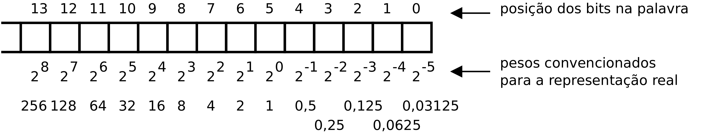

Valores e expressões
********************

Tipos básicos
=============

Identificadores -- ``bool``, ``char``, ``int``, ``float``, ``double``

Modificadores de dimensão -- ``short``, ``long``

Modificadores de sinal -- ``signed``, ``unsigned``

**Combinações válidas**

*character types* -- ``char``, ``char``, ``signed char``, ``unsigned char`` 

*signed integer types* -- ``signed char``, ``short int``, ``int``, ``long int``, ``long long int`` 

*unsigned integer types* -- `bool``, ``unsigned char``, ``unsigned short int``, ``unsigned int``, ``unsigned long int``, ``unsigned long long int`` 

*floating types* -- ``float``, ``double``, ``long double``

*integer types* -- *character types*, *signed integer types*, *unsigned integer types*, *enumerated types*

*arithmetic types* -- *integer types*, *floating types*

A palavra ``int`` pode ser omitida quando se lhe aplica modificadores.
Por exemplo, a palavra ``short`` isolada é equivalente a ``short int``.

Representação
-------------

Os valores são representados em sequências contíguas de um ou mais *bytes*.

Os valores *unsigned* são codificados em binário natural.

Os valores *signed* são codificados em código dos complementos para dois
-- o *bit* de maior peso representa o valor :math:`-2^{N-1}`.

   Representação de valores inteiros

A linguagem C não define a representação interna dos valores *float*.
A norma IEE754 é a mais utilizada.

Dimensões
---------

A precisão da representação depende do número de *bits* utilizados na representação.

Os tipos *standard* são codificados com um número de *bits* múltiplo de 8 (dimensão do *byte*).

Operador ``sizeof`` devolve a dimensão de uma variável ou de um tipo.
A unidade de medida é a dimensão do tipo ``char``.

Limites
-------

No ficheiro ``limits.h`` encontram-se declarados símbolos que indicam
a dimensão de representação dos tipos inteiros -- símbolos com sufixo ``_WIDTH``.
Assim como os símbolos que representam os valores limite do alcance de representação de cada tipo.

Dimensões **mínimas** impostas pela especificação da linguagem C para cada tipo:

**char**
........

A linguagem C não especifica se o tipo **char** codifica números naturais ou relativos.
O compilador GCC, assim como a generalidade dos compiladores,
assume que o tipo **char** representa valores no conjunto dos números relativos (*signed values*).

+-------------------------------+------------------------------------------+
| Dimensão                      | Limites                                  |  
+===================+===========+================+=========================+
| CHAR_BIT          |         8 |                |                         |  
+-------------------+-----------+----------------+-------------------------+
| SCHAR_WIDTH       |  CHAR_BIT | SCHAR_MAX      | +127                    |
+-------------------+-----------+----------------+-------------------------+
|                   |           | SCHAR_MIN      | -128                    |
+-------------------+-----------+----------------+-------------------------+
| UCHAR_WIDTH       |  CHAR_BIT | UCHAR_MAX      |  255                    |
+-------------------+-----------+----------------+-------------------------+
| CHAR_WIDTH        |  CHAR_BIT | CHAR_MAX       |  UCHAR_MAX ou SCHAR_MAX |
+-------------------+-----------+----------------+-------------------------+
|                   |           | CHAR_MIN       |  0 ou SCHAR_MIN         |
+-------------------+-----------+----------------+-------------------------+

**short**
.........

+-------------------------------+------------------------------------------+
| Dimensão                      | Limites                                  |  
+===================+===========+================+=========================+
| SHRT_WIDTH        |  16       | SHRT_MAX       | +32767                  |
+-------------------+-----------+----------------+-------------------------+
|                   |           | SHRT_MIN       | -32768                  |
+-------------------+-----------+----------------+-------------------------+
| USHRT_WIDTH       |  16       | USHRT_MAX      | 65535                   |
+-------------------+-----------+----------------+-------------------------+

**int**
.......

+-------------------------------+------------------------------------------+
| Dimensão                      | Limites                                  |  
+===================+===========+================+=========================+
| INT_WIDTH         |  16       | INT_MAX        | +32767                  |
+-------------------+-----------+----------------+-------------------------+
|                   |           | INT_MIN        | -32768                  |
+-------------------+-----------+----------------+-------------------------+
| UINT_WIDTH        |  16       | UINT_MAX       | 65535                   |
+-------------------+-----------+----------------+-------------------------+

**long**
........

+-------------------------------+------------------------------------------+
| Dimensão                      | Limites                                  |  
+===================+===========+================+=========================+
| LONG_WIDTH        |  32       | LONG_MAX       | +2147483647             |
+-------------------+-----------+----------------+-------------------------+
|                   |           | LONG_MIN       | -2147483648             |
+-------------------+-----------+----------------+-------------------------+
| ULONG_WIDTH       |  32       | ULONG_MAX      | 4294967295              |
+-------------------+-----------+----------------+-------------------------+

**long long**
.............

+-------------------------------+------------------------------------------+
| Dimensão                      | Limites                                  |  
+===================+===========+================+=========================+
| LLONG_WIDTH       |  64       | LLONG_MAX      | +9223372036854775807    |
+-------------------+-----------+----------------+-------------------------+
|                   |           | LLONG_MIN      | -9223372036854775808    |
+-------------------+-----------+----------------+-------------------------+
| ULLONG_WIDTH      |  64       | ULLONG_MAX     | 18446744073709551615    |
+-------------------+-----------+----------------+-------------------------+

.. table:: Implementações concretas dos tipos numéricos
   :widths: auto
   :align: center
   :name: tipos_c

   +-------------------+--------+-------+-------+-------+---------------------+---------------------+
   | C                 | x86-64 | ia-32 |  ARM  |  P16  |  Java               | Kotlin              |
   +===================+========+=======+=======+=======+============+========+============+========+
   | ``char``          | 8      | 8     | 8     | 8     | ``byte``   | 8      | ``Byte``   | 8      |
   +-------------------+--------+-------+-------+-------+------------+--------+------------+--------+
   | ``short int``     | 16     | 16    | 16    | 16    | ``short``  | 16     | ``Short``  | 16     |
   +-------------------+--------+-------+-------+-------+------------+--------+------------+--------+
   | ``int``           | 32     | 32    | 32    | 16    | ``int``    | 32     | ``Int``    | 32     |
   +-------------------+--------+-------+-------+-------+------------+--------+------------+--------+
   | ``long int``      | 64     | 32    | 32    | 32    | ``long``   | 32     | ``Long``   | 32     |
   +-------------------+--------+-------+-------+-------+------------+--------+------------+--------+
   | ``long long int`` | 64     | 64    | 64    |       |            |        |            |        |
   +-------------------+--------+-------+-------+-------+------------+--------+------------+--------+
   | ``float``         | 32     | 32    | 32    |       | ``float``  | 32     | ``Float``  | 32     |
   +-------------------+--------+-------+-------+-------+------------+--------+------------+--------+
   | ``double``        | 64     | 64    | 64    |       | ``double`` | 64     | ``Double`` | 64     |
   +-------------------+--------+-------+-------+-------+------------+--------+------------+--------+
   |                   |        |       |       |       | ``char``   | 16     | ``Char``   | 16     |
   +-------------------+--------+-------+-------+-------+------------+--------+------------+--------+
   |                   |        |       |       |       | ``boolean``|        | ``Boolean``|        |
   +-------------------+--------+-------+-------+-------+------------+--------+------------+--------+

Portabilidade - stdint
----------------------

Se se pretender portabilidade entre sistemas diferentes,
terá que se prestar atenção ao domínio de valores dos tipos utilizados.
Uma forma de garantir a mesma dimensão para os tipos básicos em sistemas diferentes,
é usar os tipos com dimensão explicita, definidos em **stdint.h**.

+---------+----------+----------+----------+
| int8_t  | int16_t  | int32_t  | int64_t  |
+---------+----------+----------+----------+
| uint8_t | uint16_t | uint32_t | uint64_t |
+---------+----------+----------+----------+

Possíveis definições de ``uint64_t`` para as arquiteturas IA-32 e X86-64 respetivamente:

.. code-block:: c

   typedef	unsigned long long	uint64_t;	/* IA-32 */
   typedef	unsigned long		uint64_t;	/* x86-64 */

Alinhamento
-----------
O alinhamento impõe restrições aos endereços de memória onde um objeto pode ser alocado.
É o número de *bytes* entre endereços sucessivos, onde o objeto pode ser alocado, a partir do endereço 0.

Valores reais
=============

Vírgula fixa
----------------------

Os números reais podem ser representados em base binária
usando as mesmas regras de significância posicional usadas em base decimal.

Por exemplo, 23,625 representa em base decimal,
o mesmo valor  que 10111,101 em base binária.

Em base decimal as posições representadas valem respetivamente
10 :sup:`1` (10), 10 :sup:`0` (1),  10 :sup:`-1` (0,1), 10 :sup:`-2` (0,01) e 10 :sup:`-3` (0,001),
o valor representado (23,625) resulta da adição de duas dezenas, mais três unidades,
mais seis décimas, mais duas centésimas e mais cinco milésimas.

Em base binária as posições representadas valem respetivamente
2 :sup:`4` (16), 2 :sup:`3` (8), 2 :sup:`2` (4), 2 :sup:`1` (2), 2 :sup:`0` (1),
2 :sup:`-1` (0,5), 2 :sup:`-2` (0,25) e 2 :sup:`-3` (0,125),
o valor representado (10111,101) resulta da adição de dezasseis,
mais quatro, mais dois, mais um, mais 0,5 e mais 0,125.

   
   Representação de número real em virgula fixa
   
**Exemplo**

Função para converter uma *string*, representando um valor real em base decimal,
para representação em binário sobre uma variável do tipo ``unsigned long int``.
Na representação binária assumir a posição ``BIN_FRAC`` como a posição de peso unitário.
Relativamente à :numref:`real_fixed` seria a posição 5.

.. literalinclude:: ../../../code/values_expressions/float/calc_fixed.c
   :language: c
   :linenos:
   :lines: 13-27
   :caption: Conversão de texto para representação em virgula fixa
   
   
**Exemplo**

Função para converter a representação de um número real em binário com virgula na posição ``BIN_FRAC``
para uma representação em texto, na base decimal com ``DEC_FRAC`` casas decimais.

.. literalinclude:: ../../../code/values_expressions/float/calc_fixed.c
   :language: c
   :linenos:
   :lines: 29,35-55
   :caption: Conversão de representação em virgula fixa para texto

**Exercício**

Completar o esboço de programa apresentado abaixo
que realiza as quatro operações aritméticas básicas
sobre números reais representados em binário com ``BIN_FRC`` casas fracionárias.

.. literalinclude:: ../../../code/values_expressions/float/calc_fixed.c
   :language: c
   :linenos:
   :lines: 59,69-76,78-79,82-83,86-87,89-92
   :caption: Operações aritméticas em vigula fixa

Vírgula flutuante (IEEE 754)
----------------------------

   Representação de número real em virgula flutuante (formato IEEE754)

Os *bits* das posições 22 a 0 valem, respetivamente, os valores :math:`2^{-1}` a :math:`2^{-23}`.

   Visualização de número real em virgula flutuante (formato IEEE754)

+-------+-------------+----------+----------------------------------------------------+
| Sinal | Expoente    | Mantissa | Valor                                              |
+-------+-------------+----------+----------------------------------------------------+
| s     | 0 < e < 255 | m        | :math:`(-1)^s * 2^{e-127} * (1 + m)` (normalized)  |
+-------+-------------+----------+----------------------------------------------------+
| s     | 0           | m != 0   | :math:`(-1)^s * 2^{-126} * (1 + m)` (unnormalized) |
+-------+-------------+----------+----------------------------------------------------+
| 0     | 0           | 0        | zero                                               |
+-------+-------------+----------+----------------------------------------------------+
| 1     | 0           | 0        | -zero                                              |
+-------+-------------+----------+----------------------------------------------------+
| s     | 255         | m != 0   | NaN (Not a Number)                                 |
+-------+-------------+----------+----------------------------------------------------+
| 0     | 255         | 0        | +infinito                                          |
+-------+-------------+----------+----------------------------------------------------+
| 1     | 255         | 0        | -infinito                                          |
+-------+-------------+----------+----------------------------------------------------+

**Exemplo**

**1 10000101 11011010100000000000000**

s :math:`= -1` e :math:`= 133` m :math:`= 0b11011010100000000000000`

Mantissa :math:`= 2^{-1} + 2^{-2} + 2^{-4} + 2^{-5} + 2^{-7} + 2^{-9}`
:math:`= 0,5 + 0,25 + 0,0625 + 0,03125 + 0,0078125 + 0,001953125 = 0,853515625`

Valor representado :math:`= (-1)^1 * 2^{133-127} * 1,853515625 = -118,625`

   Visualização da representação de 118,625 em base binária

**Exemplo**

Programa que imprime no terminal o conteúdo binário de um valor do tipo **float**.

.. literalinclude:: ../../../code/values_expressions/float/float_print_bin.c
   :language: c
   :linenos:
   :lines: 4-22

**Exercícios**

   1. Fazer um programa que leia um valor real do terminal e imprima a respetiva representação binária.
      Verificar que a codificação do valor 16777217,0 é igual à do valor 16777216,0. Porquê?
 
   2. Fazer um programa que verifique se a parte inteira de um valor do tipo **float** é representável numa variável do tipo **int**.

**Limites**

Maior magnitude codificável: 0 11111110 111 1111 1111 1111 1111 1111

:math:`2^{254-127} * (1,11111111111111111111111)_2`

::

   #define FLT_MAX 3.40282346638528859811704183484516925e+38F

Menor magnitude codificável: 0 00000001 000 0000 0000 0000 0000 0000

:math:`2^{1-127} * (1,00000000000000000000000)_2`

::

   #define FLT_MIN 1.17549435082228750796873653722224568e-38F

Maior magnitude codificável sem erro:

:math:`2^{150-127} * (1,11111111111111111111111)_2`

Valor 16777215.

**Sempre que a mantissa (ou significante)
tenha um afastamento entre dígitos significativos maior que 23 posições,
há erro na codificação do float**.

   Pesos na base de numeração binária

Valores e variáveis
===================

Em linguagem C não há inferência de tipo na definição de variáveis --
é  necessário explicitar o tipo.

+-------------+-----------------+
| **C**       | **Kotlin**      |
+=============+=================+
| char a;     | var a: Byte     |
+-------------+-----------------+
| int b;      | var b: Int      |
+-------------+-----------------+
| int c = 10; | var c: Int = 10 |
+-------------+-----------------+
| int d = 3;  | var d = 3       |
+-------------+-----------------+

Constantes
-----------

+---------------------+-------------------------+-----------------------+
| notação decimal     | ndd (n-1..9; d-0..9)    | 123                   |
+---------------------+-------------------------+-----------------------+
| notação binária     | 0bddd (d-0..1)          | 0b01001 (nove)        |
+---------------------+-------------------------+-----------------------+
| notação octal       | 0ddd (d-0..7)           | 023 (dezanove)        |
+---------------------+-------------------------+-----------------------+
| notação hexadecimal | 0xhh (h-0..7,a..f,A..F) | 0x23 (trinta e cinco) |
+---------------------+-------------------------+-----------------------+

A plica é usada como separador de grupo. Exemplos:
   * 1'000'000 = um milhão (1_000_000 -- Kotlin);
   * 0b0110'1010'1000 = 0x6a8 (0x0110_1010_1100 – Kotlin).

Em linguagem C os valores não alteráveis
(o equivalente a **val** da linguagem Kotlin e designados por constantes na linguagem C)
podem ser definidos de duas formas:
através de *macros* ou colocando a palavra **const** no início da definição de variável.

.. code-block:: c

   #define	TEN	10

ou

.. code-block:: c

   const int ten = 10;

As macros são um mecanismo de substituição textual, que ocorre antes da compilação do programa.
Além da definição de constantes, podem também ser utilizadas para outros fins.
No exemplo, todas as ocorrências de **TEN** no texto do programa,
serão substituídas por 10.
A utilização de macros é uma forma muito comum de se definirem valores constantes em linguagem C.

A definição prefixada com **const** significa em Kotlin,
que o valor é determinado em compilação.
Em linguagem C depende da posição, se for externa às funções,
o valor é determinado em compilação, como em Kotlin,
se for interna às funções, é calculado em execução.

Enumerados
..........

Em linguagem C um enumerado têm a seguinte sintaxe:

`enum identifier { identifier [= constant-expression] [, identifier = [constant-expression]] };`

Os elementos de um enumerado são do tipo **int**
e têm o valor numérico da expressão associada.
Se não existir expressão associada, o valor numérico é o sucessor do valor anterior
ou zero no caso de ser o primeiro elemento.

.. code-block:: c

   enum mounth { JAN = 1, FEV, MAR, ABR, MAI, JUN, JUL, AGO, SET, OUT, NOV, DEZ};
   enum mounth m = FEV;
   int n = m;

O identificador de um elemento do enumerado é global.
Não pode existir um identificador igual em mais do que um enumerado.

Modificadores **U** e **L** em constantes
.........................................

Por omissão uma constante é do tipo **int**.
Os sufixos **U** e **L** modificam o tipo da constante para **unsigned** e **long**, respetivamente.

**3U** representa o valor três do tipo **unsigned int**).

**3UL**  representa o valor três do tipo **unsigned long int**.

(usar exemplos com afetações)

.. code-block:: c

   long d = 1L << 31;		/* resulta o valor 2147483648 */
   long e = 1  << 31;		/* resulta o valor -2147483648 */

   int f = (1  << 31) >> 31;	/* resulta o valor -1 */
   int g = (1U << 31) >> 31;	/* resulta o valor 1 */

**Convenções**

Na formação de nomes de variáveis ou funções, a convenção geral é utilizar letras minúsculas
e no caso de nomes compostos por várias palavras, separar com *underscore*.
Por exemplo uma variável que represente o número de pessoas numa sala
poderia ter o nome **people_in_room**.
Tradicionalmente, embora atualmente se desaconselhe, os nomes podem ser formados por aglomeração de abreviaturas,
como por exemplo **errno**, para designar a variável que armazena o número de um erro.

Por convenção, os identificadores de constantes são formados por letras maiúsculas.
Nos identificadores compostos, as palavras são separadas por *underscore*.
Por exemplo, o identificador que represente a dimensão máxima de uma palavra:

.. code-block:: c

   #define	WORD_MAX_SIZE	50

Operações numéricas
===================

Operações aritméticas
---------------------

.. table:: Operadores aritméticos
   :widths: auto
   :align: center

   +-----------------+----------------------+--------------------------------+---------------------+
   | **+** adição    | **\*** multiplicação | **%** resto da divisão inteira | **++** incremento   |
   +-----------------+----------------------+--------------------------------+---------------------+
   | **-** subtração | **/** divisão        |                                | **\-\-** decremento |
   +-----------------+----------------------+--------------------------------+---------------------+

Operações *bit-a-bit* (*bitwise operations*)
--------------------------------------------

.. table:: Operações diretas sobre *bits*
   :widths: auto
   :align: center

   +--------+--------------------------+--------+---------+
   |        |                          | C      | Kotlin  |
   +========+==========================+========+=========+
   | **<<** | deslocar para a esquerda | a << 3 | a shl 3 |
   +--------+--------------------------+--------+---------+
   | **>>** | deslocar para a direita  | b >> 8 | b shr 8 |
   +--------+--------------------------+--------+---------+
   | **&**  | conjunção                | a & b  | a and b |
   +--------+--------------------------+--------+---------+
   | **|**  | disjunção                | a \| b | a or b  |
   +--------+--------------------------+--------+---------+
   | **^**  | disjunção exclusiva      | a ^ b  | a xor b |
   +--------+--------------------------+--------+---------+
   | **~**  | negação                  | ~a     | inv a   |
   +--------+--------------------------+--------+---------+

Na deslocação para a direita, o *bit* de maior peso mantém o valor
se estiver a operar sobre um tipo com sinal
ou recebe zero se estiver a operar sobre um tipo sem sinal.

Exemplos:

   ======================= ======================================================================
   ``b = a << p``          Deslocar um valor para a esquerda **p** posições                      
   ``b = a & ~(1 << p);``  Colocar **0** no *bit* da posição **p**                               
   ``b = a | 1 << p``      Colocar **1** no *bit* da posição **p**                               
   ``b = a & (1 << p))``   Isolar o *bit* da posição **p**                                       
   ``b = ~(~0 << n) << p`` Formar uma sequência de **n** *bits* a **1** a partir da posição **p**
   ======================= ======================================================================

Operações relacionais
------------------------

.. table:: Operadores relacionais
   :widths: auto
   :align: center

   ====== ============== ===== =========== ====== ================
   **==** igual a        **>** maior que   **>=** maior ou igual a
   **!=** diferente de   **<** menor que   **<=** menor ou igual a
   ====== ============== ===== =========== ====== ================

As operações relacionais produzem valores booleanos -- **true** ou **false**.

::

   int x = 20;
   bool y = x == 20;

Operações booleanas
-------------------

.. table:: Operadores booleanos
   :widths: auto
   :align: center

   ====== =========    ====== =========   =====  =======
   **&&** conjunção    **||** disjunção   **!**  negação
   ====== =========    ====== =========   =====  =======

A avaliação de expressões booleanas realiza-se da esquerda para a direita.
Se na avaliação de uma sub-expressão o resultado for igual ao elemento absorvente,
as restantes sub-expressões já não serão avaliadas (*lazzy evaluation*).

Os operandos naturais destes operadores são valores booleanos.
Nas versões da linguagem anteriores à C23 não existia tipo **bool**,
por isso é comum verem-se expressões booleanas em que os operandos são valores numéricos.

::

   int flag;

   if (!flag)
      ...

O que acontece nestes casos, é uma conversão implícita de valor numérico
para valor booleano. A regra é a seguinte:
um valor numérico de zero é equivalente a **false**
e um valor numérico diferente de zero é equivalente a **true**.

Expressões
==========

Uma expressão tem um valor associado que resulta da aplicação de operações sobre valores.
Esses valores podem ser constantes, variáveis, chamadas a funções ou o resultado de outras operações.
Na avaliação de uma expressão estão envolvidos três conceitos:
prioridade dos operadores, ordem de associação de operadores e ordem de avaliação de operandos.

   .. table:: Réplica da tabela 2.1 *Precedence and Associativity of Operators* [#f1]_
      :widths: auto
   
      ======================================== ================ =====================================
      Operadores                               Associatividade  Operação                             
      ======================================== ================ =====================================
      **( ) [ ] -> .**                         left to right    função; indexação; campo de estrutura
      **! ~ ++ -- + - \* & (*type*) sizeof**   right to left    falso; negar *bit-a-bit*; incrementar; decrementar;            
                                                                positivo; negativo; desreferenciar; endereço de;          
                                                                forçar o tipo; dimensão              
      **\* / %**                               left to right    multiplicação; divisão; resto da divisão
      **+ -**                                  left to right    adição; subtracção
      **<< >>**                                left to right    deslocamento dos bits
      **< <= > >=**                            left to right    relacionais
      **+ -**                                  left to right    adição; subtracção
      **== !=**                                left to right    igual; diferente
      **&**                                    left to right    e bit-a-bit
      **^**                                    left to right    ou exclusivo bit-a-bit
      **|**                                    left to right    ou bit-a-bit
      **&&**                                   left to right    e
      **||**                                   left to right    ou
      **? :**                                  left to right    expressão condicional
      **= += -= *= /= %= &= |= ^= <<= >>=**    right to left    afetação e afetação com operação                                                      
      **,**                                    left to right    operador vírgula
      ======================================== ================ =====================================

Prioridade dos operadores
-------------------------

Exemplos

   * ``a + b * c`` é equivalente a ``a + (b * c)``
   * ``a & b == 2`` é equivalente a ``a & (b == 2)``

**Exercício**

Determinar o valor de ``a & b == 2`` e de ``(a & b) == 2``, se **a = 6** e **b = 3**.

Ordem de associação
-------------------

Ordem de realização das operações em expressões com sequência de operadores da mesma prioridade
(a maioria associa das esquerda para a direita).

a + b - c = (a + b) - c

f1() + f2() + f3() (a ordem de associação não define a ordem de avaliação)

Ordem de avaliação
------------------

A ordem de avaliação dos operandos só está definida para os operadores **&&** **||** **?:** **,**. 

Nas operações **&&** e **||** aplica-se o critério *lazzy evaluation*.

::

   f1() && f2()
   f1() || f2()

Expressões como ``x = f() + g();`` produzem resultados imprevisíveis,
se existir alguma dependência entre f() e g()

::

   int x = 5;
   int f() {
       return  x += 1;
   }
   int g() {
       return  x *= 10;
   }

Outro exemplo de comportamento indefinido: ``printf(“%d %d\n”, ++n, power2(2, n));``.

Expressão condicional
---------------------

A expressão ``var = expr1 ? expr2 : expr3`` é equivalente a

::

   if (expr1)
       var = expr2;
   else
       var = expr3;

com a diferença de poder ser utilizada como expressão (onde é suposto aparecer um valor).

Exemplo ::

   int minor = a < b ? a : b;

Operador afetação
-----------------

A utilização mais comum do operador **=** é na simples afetação de valores a variáveis.

::

   int x = 20;
   int y = x * 10;

Em linguagem C os operadores afetação produzem valor.
Podem ser embebidos numa expressão e o seu resultado ser operado por um operador.
O valor produzido pela operação de afetação é o valor do operando do lado direito.

::

   while ((c = getchar()) != '\n')
      ;

Primeiro a variável **c** é afetada com o valor do código do caractere devolvido por ``getchar()``.
Desta afetação resulta esse valor, que vai ser comparado com o código do caractere ``\n``.

Também permite realizar uma cadeia de afetações.

::

   a = b = c = 7;

Como associa da direita para a esquerda, a expressão anterior é equivalente a

::

   a = (b = (c = 7));

Tem a seguinte interpretação: afeta **c** com **7** donde resulta o valor **7**
que por sua vez é afetado à variável **b**, donde resulta o mesmo valor **7**
que por sua vez é afetado à variavel **a**. Ficando todas as variáveis com o mesmo valor.

Os operadores **+= -= *= /= %= &= ^= |= <<= >>=** realizam a operação indicada à esquerda do sinal **=**.
A variável escrita à esquerda é o destino e o primeiro operando.

Por exemplo ``m |= 2`` é equivalente a ``m = m | 2``.

Operarador vírgula
------------------
O operador vírgula permite colocar mais do que uma expressão
em locais onde sintaticamente só poderia ser colocada uma expressão.
As expressões individuais vão sendo avaliadas da esquerda para a direita
e os seus valores vão sendo descartados,
exceto o valor da última expressão que é utilizado como o valor associado à operação.

Exemplos

::

   for (i = 0, j = 0; i < MAX; ++i, j += 2)

::

   if (failure)
       return (error = failure_code, -1);

::

   x = 1, 2;        /* valor final de x é 1 */
   y = (3, 4);      /* valor final de y é 4 */

Conversão de tipos
==================
Na linguagem C é possível afetar uma variável do qualquer tipo inteiro
com um valor de outro tipo inteiro.
A representação dos tipos inteiros (char, short, int, long) diferem entre si
apenas no número de *bits*.

Conversão sem perda de informação
---------------------------------

Na conversão de tipo cujo domínio de representação está contido no domínio
de representação do tipo destino --
representação com menos *bits* para representação com mais *bits* --
não há perda de informação.
Para manter a mesma representação numérica os *bits* de maior peso
recebem zero no caso de valores naturais
ou o valor do *bit* de sinal no caso de valores relativos.

Conversão com perda de informação
---------------------------------

Na conversão de tipo cujo domínio de representação é diferente
do domínio de representação do tipo destino, pode haver perda de informação.
Para o evitar, cabe ao programador garantir
que o valor a converter é representável no domínio do tipo destino.

Conversão entre valores numéricos e booleanos
---------------------------------------------
No sentido de valor numérico para booleano, o valor zero converte para **false**
e um valor diferente de zero converte para **true**.

No sentido de valor booleano para numérico, o valor **false** converte para zero
e o valor **true** converte para um.

Texto
=====

Caracteres
----------

Os caracteres são codificados como valores numéricos segundo uma tabela de codificação (Unicode, ASCII, ISO-8859-xx, etc).

Um caractere é representado por um valor numérico que pode ser afetado a uma variável numérica de qualquer tipo (char, short, int ou long). Embora o mais adequado seja o tipo char.

Em linguagem C qualquer das seguintes definições de variável é válida, embora algumas possam não ser adequadas.

::

   char c = ‘a’;
   char d = ‘d’;
   int e = ‘f’;
   long f = ‘g’;

A especificação de caracteres literais, incluindo as sequências de escape:

``'a'..'z' 'A'..'Z' '\a' '\b' '\f' '\n' '\r' '\t' '\v' '\\' '\'' '\”‘ '\123' '\xhh'``

========================= ================================ ===========================
``\a`` alerta             ``\b`` retroceder (*backspace*)  ``\f`` avanço de página
``\n`` nova linha         ``\r`` coloca cursor na coluna 0 ``\t`` tabulador horizontal
``\v`` tabulador vertical ``\\`` o próprio \\               ``\'`` plica 
``\”`` aspas
========================= ================================ ===========================

Strings
-------

A linguagem C não define formalmente a existência de variáveis do tipo *string*
como ``String`` em Java ou em Kotlin.
No entanto utiliza a mesma notação sintática para definir literais do tipo *string*.

::

   “Isto é uma string em C, em Java ou em Kotlin”

Em linguagem C um literal do tipo string é formalmente considerado um array de elementos do tipo char.
Por exemplo: ::

   char greetings[] = “Bom-dia!”;

Os códigos numéricos dos caracteres que compõem “Bom-dia!” são armazenados nas sucessivas posições do *array* ``greetings``.
Na posição a seguir à do código do último caractere é colocado o valor numérico zero
para indicar o final da *string* (indiretamente define a sua dimensão).
Assim, a definição acima produz um *array* de valores do tipo *char*
com nove posições e a seguinte ocupação:

   .. figure:: string.svg
      :align: center
      :scale: 120%

Utilizando o operador indexação sobre este *array* poderemos obter ou modificar os valores
numéricos de cada posição. ``greeting[0]`` corresponde ao valor numérico 66 que representa a letra ‘B’;
``greeting[7]`` dá acesso ao valor numérico 33 que é o código numérico do ponto de exclamação.
 
Exemplos de definição de *strings* em C: ::

   char string1[] = "string terminada com mudança de linha\n";

   char string2[] = "uma string dividida"
                    "em duas linhas";

Referências
===========

Norma da linguagem C - ISO/IEC 9899:2023 (draft `N3096 <https://www9.open-std.org/JTC1/SC22/WG14/www/docs/n3096.pdf>`_)

.. rubric:: Footnotes

.. [#f1] The C programming Language
